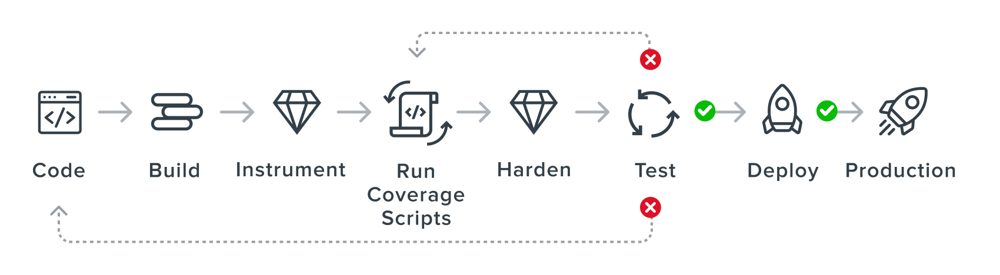

<a href="https://rapidfort.com?utm_source=github&utm_medium=ci_rf_link&utm_campaign=sep_01_sprint&utm_term=ci_main_landing&utm_content=main_landing_logo">

</a>

<h1> community-images </h1>


[![RF Hardened][rf-h-badge]][rf-link-hardened-badge]
[![Dockerhub][dh-rf-badge]][dh-rf]
[![Slack][slack-badge]][slack-link]
[![License][license-badge]][license]
[![FOSSA Status][fossa-badge]][fossa-link]
[](https://bestpractices.coreinfrastructure.org/projects/6087)
[](https://github.com/rapidfort/community-images/actions/workflows/codeql.yml)


[Getting started](#getting-started) ·
[Supported containers](#supported-containers) ·
[Contributing](CONTRIBUTING.md) ·
[Build Process](#how-community-images-are-built) ·
[Additional resources](#additional-resources)

**RapidFort is a solution for building secure, optimized Docker containers.**

Every day, we scan the most popular Docker Hub container images and remove unused code. Then we publish the results to share with you.

Our container optimization process reduces the software attack surface and the chance of a vulnerability exploit.

Stop downloading container images with thousands of vulnerabilities. Start using secure containers with minimized attack surfaces.


## Getting Started

![Demo][demo]

[RapidFort][rf-link-getting-started] scans your Docker containers for vulnerabilities and looks for unused components that can be removed.

<h2 id="supported-containers">What containers are supported?</h2>

We’ve optimized and hardened some of the most popular container images on Docker Hub and are making them available to the community.

| Repository                        | View Report                                   | RapidFort Image                     | Pull Count |
|-----------------------------------| ------------------------------------------     | ------------------------------- | ------------------------------- |
| [PostgreSQL][ postgresql-github-link]| <a href="https://frontrow.rapidfort.com/app/community/imageinfo/docker.io%2Fbitnami%2Fpostgresql?utm_source=github&utm_medium=ci_view_report&utm_campaign=sep_01_sprint&utm_term=postgresql&utm_content=landing_get_full_report_button">  </a> | <a href="https://hub.docker.com/r/rapidfort/postgresql">  </a> | <b> 90,892 </b> |
| [MariaDB][ mariadb-github-link]| <a href="https://frontrow.rapidfort.com/app/community/imageinfo/docker.io%2Fbitnami%2Fmariadb?utm_source=github&utm_medium=ci_view_report&utm_campaign=sep_01_sprint&utm_term=mariadb&utm_content=landing_get_full_report_button">  </a> | <a href="https://hub.docker.com/r/rapidfort/mariadb">  </a> | <b> 90,458 </b> |
| [Redis™ Cluster][ redis-cluster-github-link]| <a href="https://frontrow.rapidfort.com/app/community/imageinfo/docker.io%2Fbitnami%2Fredis-cluster?utm_source=github&utm_medium=ci_view_report&utm_campaign=sep_01_sprint&utm_term=redis-cluster&utm_content=landing_get_full_report_button">  </a> | <a href="https://hub.docker.com/r/rapidfort/redis-cluster">  </a> | <b> 82,134 </b> |
| [MySQL][ mysql-github-link]| <a href="https://frontrow.rapidfort.com/app/community/imageinfo/docker.io%2Fbitnami%2Fmysql?utm_source=github&utm_medium=ci_view_report&utm_campaign=sep_01_sprint&utm_term=mysql&utm_content=landing_get_full_report_button">  </a> | <a href="https://hub.docker.com/r/rapidfort/mysql">  </a> | <b> 72,525 </b> |
| [Redis™][ redis-github-link]| <a href="https://frontrow.rapidfort.com/app/community/imageinfo/docker.io%2Fbitnami%2Fredis?utm_source=github&utm_medium=ci_view_report&utm_campaign=sep_01_sprint&utm_term=redis&utm_content=landing_get_full_report_button">  </a> | <a href="https://hub.docker.com/r/rapidfort/redis">  </a> | <b> 69,973 </b> |
| [MongoDB®][ mongodb-github-link]| <a href="https://frontrow.rapidfort.com/app/community/imageinfo/docker.io%2Fbitnami%2Fmongodb?utm_source=github&utm_medium=ci_view_report&utm_campaign=sep_01_sprint&utm_term=mongodb&utm_content=landing_get_full_report_button">  </a> | <a href="https://hub.docker.com/r/rapidfort/mongodb">  </a> | <b> 63,643 </b> |
| [NGINX IronBank][ nginx-ib-github-link]| <a href="https://frontrow.rapidfort.com/app/community/imageinfo/registry1.dso.mil%2Fironbank%2Fopensource%2Fnginx%2Fnginx?utm_source=github&utm_medium=ci_view_report&utm_campaign=sep_01_sprint&utm_term=nginx-ib&utm_content=landing_get_full_report_button">  </a> | <a href="https://hub.docker.com/r/rapidfort/nginx-ib">  </a> | <b> 63,135 </b> |
| [Grafana Oncall][ oncall-github-link]| <a href="https://frontrow.rapidfort.com/app/community/imageinfo/docker.io%2Fgrafana%2Foncall?utm_source=github&utm_medium=ci_view_report&utm_campaign=sep_01_sprint&utm_term=oncall&utm_content=landing_get_full_report_button">  </a> | <a href="https://hub.docker.com/r/rapidfort/oncall">  </a> | <b> 59,575 </b> |
| [Redis™ IronBank][ redis-ib-github-link]| <a href="https://frontrow.rapidfort.com/app/community/imageinfo/registry1.dso.mil%2Fironbank%2Fopensource%2Fredis%2Fredis6?utm_source=github&utm_medium=ci_view_report&utm_campaign=sep_01_sprint&utm_term=redis-ib&utm_content=landing_get_full_report_button">  </a> | <a href="https://hub.docker.com/r/rapidfort/redis6-ib">  </a> | <b> 58,283 </b> |
| [NGINX][ nginx-github-link]| <a href="https://frontrow.rapidfort.com/app/community/imageinfo/docker.io%2Fbitnami%2Fnginx?utm_source=github&utm_medium=ci_view_report&utm_campaign=sep_01_sprint&utm_term=nginx&utm_content=landing_get_full_report_button">  </a> | <a href="https://hub.docker.com/r/rapidfort/nginx">  </a> | <b> 58,166 </b> |
| [PostgreSQL IronBank][ postgresql-ib-github-link]| <a href="https://frontrow.rapidfort.com/app/community/imageinfo/registry1.dso.mil%2Fironbank%2Fopensource%2Fpostgres%2Fpostgresql12?utm_source=github&utm_medium=ci_view_report&utm_campaign=sep_01_sprint&utm_term=postgresql-ib&utm_content=landing_get_full_report_button">  </a> | <a href="https://hub.docker.com/r/rapidfort/postgresql12-ib">  </a> | <b> 58,043 </b> |
| [Envoy][ envoy-github-link]| <a href="https://frontrow.rapidfort.com/app/community/imageinfo/docker.io%2Fbitnami%2Fenvoy?utm_source=github&utm_medium=ci_view_report&utm_campaign=sep_01_sprint&utm_term=envoy&utm_content=landing_get_full_report_button">  </a> | <a href="https://hub.docker.com/r/rapidfort/envoy">  </a> | <b> 48,369 </b> |
| [PostgreSQL Official][ postgresql-official-github-link]| <a href="https://frontrow.rapidfort.com/app/community/imageinfo/docker.io%2Flibrary%2Fpostgres?utm_source=github&utm_medium=ci_view_report&utm_campaign=sep_01_sprint&utm_term=postgresql-official&utm_content=landing_get_full_report_button">  </a> | <a href="https://hub.docker.com/r/rapidfort/postgresql-official">  </a> | <b> 43,458 </b> |
| [Fluentd][ fluentd-github-link]| <a href="https://frontrow.rapidfort.com/app/community/imageinfo/docker.io%2Fbitnami%2Ffluentd?utm_source=github&utm_medium=ci_view_report&utm_campaign=sep_01_sprint&utm_term=fluentd&utm_content=landing_get_full_report_button">  </a> | <a href="https://hub.docker.com/r/rapidfort/fluentd">  </a> | <b> 43,257 </b> |
| [MariaDB IronBank][ mariadb-ib-github-link]| <a href="https://frontrow.rapidfort.com/app/community/imageinfo/registry1.dso.mil%2Fironbank%2Fopensource%2Fmariadb%2Fmariadb?utm_source=github&utm_medium=ci_view_report&utm_campaign=sep_01_sprint&utm_term=mariadb-ib&utm_content=landing_get_full_report_button">  </a> | <a href="https://hub.docker.com/r/rapidfort/mariadb-ib">  </a> | <b> 42,152 </b> |
| [MySQL IronBank][ mysql-ib-github-link]| <a href="https://frontrow.rapidfort.com/app/community/imageinfo/registry1.dso.mil%2Fironbank%2Fopensource%2Fmysql%2Fmysql8?utm_source=github&utm_medium=ci_view_report&utm_campaign=sep_01_sprint&utm_term=mysql-ib&utm_content=landing_get_full_report_button">  </a> | <a href="https://hub.docker.com/r/rapidfort/mysql8-ib">  </a> | <b> 42,081 </b> |
| [Etcd][ etcd-github-link]| <a href="https://frontrow.rapidfort.com/app/community/imageinfo/docker.io%2Fbitnami%2Fetcd?utm_source=github&utm_medium=ci_view_report&utm_campaign=sep_01_sprint&utm_term=etcd&utm_content=landing_get_full_report_button">  </a> | <a href="https://hub.docker.com/r/rapidfort/etcd">  </a> | <b> 40,830 </b> |
| [InfluxDB™][ influxdb-github-link]| <a href="https://frontrow.rapidfort.com/app/community/imageinfo/docker.io%2Fbitnami%2Finfluxdb?utm_source=github&utm_medium=ci_view_report&utm_campaign=sep_01_sprint&utm_term=influxdb&utm_content=landing_get_full_report_button">  </a> | <a href="https://hub.docker.com/r/rapidfort/influxdb">  </a> | <b> 29,912 </b> |
| [Zookeeper][ zookeeper-github-link]| <a href="https://frontrow.rapidfort.com/app/community/imageinfo/docker.io%2Fbitnami%2Fzookeeper?utm_source=github&utm_medium=ci_view_report&utm_campaign=sep_01_sprint&utm_term=zookeeper&utm_content=landing_get_full_report_button">  </a> | <a href="https://hub.docker.com/r/rapidfort/zookeeper">  </a> | <b> 27,478 </b> |
| [NATS][ nats-github-link]| <a href="https://frontrow.rapidfort.com/app/community/imageinfo/docker.io%2Fbitnami%2Fnats?utm_source=github&utm_medium=ci_view_report&utm_campaign=sep_01_sprint&utm_term=nats&utm_content=landing_get_full_report_button">  </a> | <a href="https://hub.docker.com/r/rapidfort/nats">  </a> | <b> 26,466 </b> |
| [RabbitMQ][ rabbitmq-github-link]| <a href="https://frontrow.rapidfort.com/app/community/imageinfo/docker.io%2Fbitnami%2Frabbitmq?utm_source=github&utm_medium=ci_view_report&utm_campaign=sep_01_sprint&utm_term=rabbitmq&utm_content=landing_get_full_report_button">  </a> | <a href="https://hub.docker.com/r/rapidfort/rabbitmq">  </a> | <b> 26,208 </b> |
| [Wordpress][ wordpress-github-link]| <a href="https://frontrow.rapidfort.com/app/community/imageinfo/docker.io%2Fbitnami%2Fwordpress?utm_source=github&utm_medium=ci_view_report&utm_campaign=sep_01_sprint&utm_term=wordpress&utm_content=landing_get_full_report_button">  </a> | <a href="https://hub.docker.com/r/rapidfort/wordpress">  </a> | <b> 25,016 </b> |
| [Apache][ apache-github-link]| <a href="https://frontrow.rapidfort.com/app/community/imageinfo/docker.io%2Fbitnami%2Fapache?utm_source=github&utm_medium=ci_view_report&utm_campaign=sep_01_sprint&utm_term=apache&utm_content=landing_get_full_report_button">  </a> | <a href="https://hub.docker.com/r/rapidfort/apache">  </a> | <b> 23,486 </b> |
| [Apache Airflow Worker][ airflow-worker-github-link]| <a href="https://frontrow.rapidfort.com/app/community/imageinfo/docker.io%2Fbitnami%2Fairflow-worker?utm_source=github&utm_medium=ci_view_report&utm_campaign=sep_01_sprint&utm_term=airflow-worker&utm_content=landing_get_full_report_button">  </a> | <a href="https://hub.docker.com/r/rapidfort/airflow-worker">  </a> | <b> 22,706 </b> |
| [Apache Airflow Scheduler][ airflow-scheduler-github-link]| <a href="https://frontrow.rapidfort.com/app/community/imageinfo/docker.io%2Fbitnami%2Fairflow-scheduler?utm_source=github&utm_medium=ci_view_report&utm_campaign=sep_01_sprint&utm_term=airflow-scheduler&utm_content=landing_get_full_report_button">  </a> | <a href="https://hub.docker.com/r/rapidfort/airflow-scheduler">  </a> | <b> 22,683 </b> |
| [Prometheus][ prometheus-github-link]| <a href="https://frontrow.rapidfort.com/app/community/imageinfo/docker.io%2Fbitnami%2Fprometheus?utm_source=github&utm_medium=ci_view_report&utm_campaign=sep_01_sprint&utm_term=prometheus&utm_content=landing_get_full_report_button">  </a> | <a href="https://hub.docker.com/r/rapidfort/prometheus">  </a> | <b> 21,200 </b> |
| [Consul][ consul-github-link]| <a href="https://frontrow.rapidfort.com/app/community/imageinfo/docker.io%2Fbitnami%2Fconsul?utm_source=github&utm_medium=ci_view_report&utm_campaign=sep_01_sprint&utm_term=consul&utm_content=landing_get_full_report_button">  </a> | <a href="https://hub.docker.com/r/rapidfort/consul">  </a> | <b> 20,675 </b> |
| [Kong][ kong-github-link]| <a href="https://frontrow.rapidfort.com/app/community/imageinfo/docker.io%2Flibrary%2Fkong?utm_source=github&utm_medium=ci_view_report&utm_campaign=sep_01_sprint&utm_term=kong&utm_content=landing_get_full_report_button">  </a> | <a href="https://hub.docker.com/r/rapidfort/kong">  </a> | <b> 18,318 </b> |
| [HAProxy Official][ haproxy-official-github-link]| <a href="https://frontrow.rapidfort.com/app/community/imageinfo/docker.io%2Flibrary%2Fhaproxy?utm_source=github&utm_medium=ci_view_report&utm_campaign=sep_01_sprint&utm_term=haproxy-official&utm_content=landing_get_full_report_button">  </a> | <a href="https://hub.docker.com/r/rapidfort/haproxy-official">  </a> | <b> 18,121 </b> |
| [Memcached][ memcached-github-link]| <a href="https://frontrow.rapidfort.com/app/community/imageinfo/docker.io%2Fbitnami%2Fmemcached?utm_source=github&utm_medium=ci_view_report&utm_campaign=sep_01_sprint&utm_term=memcached&utm_content=landing_get_full_report_button">  </a> | <a href="https://hub.docker.com/r/rapidfort/memcached">  </a> | <b> 18,091 </b> |
| [Apache Official][ apache-official-github-link]| <a href="https://frontrow.rapidfort.com/app/community/imageinfo/docker.io%2Flibrary%2Fhttpd?utm_source=github&utm_medium=ci_view_report&utm_campaign=sep_01_sprint&utm_term=apache-official&utm_content=landing_get_full_report_button">  </a> | <a href="https://hub.docker.com/r/rapidfort/apache-official">  </a> | <b> 17,240 </b> |
| [HAProxy][ haproxy-github-link]| <a href="https://frontrow.rapidfort.com/app/community/imageinfo/docker.io%2Fbitnami%2Fhaproxy?utm_source=github&utm_medium=ci_view_report&utm_campaign=sep_01_sprint&utm_term=haproxy&utm_content=landing_get_full_report_button">  </a> | <a href="https://hub.docker.com/r/rapidfort/haproxy">  </a> | <b> 16,778 </b> |
| [Apache Airflow][ airflow-github-link]| <a href="https://frontrow.rapidfort.com/app/community/imageinfo/docker.io%2Fbitnami%2Fairflow?utm_source=github&utm_medium=ci_view_report&utm_campaign=sep_01_sprint&utm_term=airflow&utm_content=landing_get_full_report_button">  </a> | <a href="https://hub.docker.com/r/rapidfort/airflow">  </a> | <b> 16,593 </b> |
| [Consul Official][ consul-official-github-link]| <a href="https://frontrow.rapidfort.com/app/community/imageinfo/docker.io%2Flibrary%2Fconsul?utm_source=github&utm_medium=ci_view_report&utm_campaign=sep_01_sprint&utm_term=consul-official&utm_content=landing_get_full_report_button">  </a> | <a href="https://hub.docker.com/r/rapidfort/consul-official">  </a> | <b> 15,976 </b> |
| [MongoDB® Official][ mongodb-official-github-link]| <a href="https://frontrow.rapidfort.com/app/community/imageinfo/docker.io%2Flibrary%2Fmongo?utm_source=github&utm_medium=ci_view_report&utm_campaign=sep_01_sprint&utm_term=mongodb-official&utm_content=landing_get_full_report_button">  </a> | <a href="https://hub.docker.com/r/rapidfort/mongodb-official">  </a> | <b> 15,639 </b> |
| [Consul IronBank][ consul-ib-github-link]| <a href="https://frontrow.rapidfort.com/app/community/imageinfo/registry1.dso.mil%2Fironbank%2Fhashicorp%2Fconsul?utm_source=github&utm_medium=ci_view_report&utm_campaign=sep_01_sprint&utm_term=consul-ib&utm_content=landing_get_full_report_button">  </a> | <a href="https://hub.docker.com/r/rapidfort/consul-ib">  </a> | <b> 14,952 </b> |
| [Curl][ curl-github-link]| <a href="https://frontrow.rapidfort.com/app/community/imageinfo/docker.io%2Fcurlimages%2Fcurl?utm_source=github&utm_medium=ci_view_report&utm_campaign=sep_01_sprint&utm_term=curl&utm_content=landing_get_full_report_button">  </a> | <a href="https://hub.docker.com/r/rapidfort/curl">  </a> | <b> 14,002 </b> |
| [Zookeeper Official][ zookeeper-official-github-link]| <a href="https://frontrow.rapidfort.com/app/community/imageinfo/docker.io%2Flibrary%2Fzookeeper?utm_source=github&utm_medium=ci_view_report&utm_campaign=sep_01_sprint&utm_term=zookeeper-official&utm_content=landing_get_full_report_button">  </a> | <a href="https://hub.docker.com/r/rapidfort/zookeeper-official">  </a> | <b> 13,584 </b> |
| [Redis™ Official][ redis-official-github-link]| <a href="https://frontrow.rapidfort.com/app/community/imageinfo/docker.io%2Flibrary%2Fredis?utm_source=github&utm_medium=ci_view_report&utm_campaign=sep_01_sprint&utm_term=redis-official&utm_content=landing_get_full_report_button">  </a> | <a href="https://hub.docker.com/r/rapidfort/redis-official">  </a> | <b> 13,509 </b> |
| [TRAEFIK][ traefik-github-link]| <a href="https://frontrow.rapidfort.com/app/community/imageinfo/docker.io%2Flibrary%2Ftraefik?utm_source=github&utm_medium=ci_view_report&utm_campaign=sep_01_sprint&utm_term=traefik&utm_content=landing_get_full_report_button">  </a> | <a href="https://hub.docker.com/r/rapidfort/traefik">  </a> | <b> 13,374 </b> |
| [Zookeeper IronBank][ zookeeper-ib-github-link]| <a href="https://frontrow.rapidfort.com/app/community/imageinfo/registry1.dso.mil%2Fironbank%2Fopensource%2Fapache%2Fzookeeper?utm_source=github&utm_medium=ci_view_report&utm_campaign=sep_01_sprint&utm_term=zookeeper-ib&utm_content=landing_get_full_report_button">  </a> | <a href="https://hub.docker.com/r/rapidfort/zookeeper-ib">  </a> | <b> 12,553 </b> |
| [MongoDB® IronBank][ mongodb-ib-github-link]| <a href="https://frontrow.rapidfort.com/app/community/imageinfo/registry1.dso.mil%2Fironbank%2Fopensource%2Fmongodb%2Fmongodb?utm_source=github&utm_medium=ci_view_report&utm_campaign=sep_01_sprint&utm_term=mongodb-ib&utm_content=landing_get_full_report_button">  </a> | <a href="https://hub.docker.com/r/rapidfort/mongodb-ib">  </a> | <b> 12,249 </b> |
| [NGINX Official][ nginx-official-github-link]| <a href="https://frontrow.rapidfort.com/app/community/imageinfo/docker.io%2Flibrary%2Fnginx?utm_source=github&utm_medium=ci_view_report&utm_campaign=sep_01_sprint&utm_term=nginx-official&utm_content=landing_get_full_report_button">  </a> | <a href="https://hub.docker.com/r/rapidfort/nginx-official">  </a> | <b> 12,003 </b> |
| [MySQL Official][ mysql-official-github-link]| <a href="https://frontrow.rapidfort.com/app/community/imageinfo/docker.io%2Flibrary%2Fmysql?utm_source=github&utm_medium=ci_view_report&utm_campaign=sep_01_sprint&utm_term=mysql-official&utm_content=landing_get_full_report_button">  </a> | <a href="https://hub.docker.com/r/rapidfort/mysql-official">  </a> | <b> 10,656 </b> |
| [Yugabyte][ yugabyte-github-link]| <a href="https://frontrow.rapidfort.com/app/community/imageinfo/docker.io%2Fyugabytedb%2Fyugabyte?utm_source=github&utm_medium=ci_view_report&utm_campaign=sep_01_sprint&utm_term=yugabyte&utm_content=landing_get_full_report_button">  </a> | <a href="https://hub.docker.com/r/rapidfort/yugabyte">  </a> | <b> 10,333 </b> |
| [Memcached Official][ memcached-official-github-link]| <a href="https://frontrow.rapidfort.com/app/community/imageinfo/docker.io%2Flibrary%2Fmemcached?utm_source=github&utm_medium=ci_view_report&utm_campaign=sep_01_sprint&utm_term=memcached-official&utm_content=landing_get_full_report_button">  </a> | <a href="https://hub.docker.com/r/rapidfort/memcached-official">  </a> | <b> 9,925 </b> |
| [Couchdb Database Server Official][ couchdb-official-github-link]| <a href="https://frontrow.rapidfort.com/app/community/imageinfo/docker.io%2Flibrary%2Fcouchdb?utm_source=github&utm_medium=ci_view_report&utm_campaign=sep_01_sprint&utm_term=couchdb-official&utm_content=landing_get_full_report_button">  </a> | <a href="https://hub.docker.com/r/rapidfort/couchdb-official">  </a> | <b> 9,655 </b> |
| [MariaDB Official][ mariadb-official-github-link]| <a href="https://frontrow.rapidfort.com/app/community/imageinfo/docker.io%2Flibrary%2Fmariadb?utm_source=github&utm_medium=ci_view_report&utm_campaign=sep_01_sprint&utm_term=mariadb-official&utm_content=landing_get_full_report_button">  </a> | <a href="https://hub.docker.com/r/rapidfort/mariadb-official">  </a> | <b> 9,548 </b> |
| [Cassandra Official][ cassandra-official-github-link]| <a href="https://frontrow.rapidfort.com/app/community/imageinfo/docker.io%2Flibrary%2Fcassandra?utm_source=github&utm_medium=ci_view_report&utm_campaign=sep_01_sprint&utm_term=cassandra-official&utm_content=landing_get_full_report_button">  </a> | <a href="https://hub.docker.com/r/rapidfort/cassandra-official">  </a> | <b> 9,520 </b> |
| [Vault][ vault-github-link]| <a href="https://frontrow.rapidfort.com/app/community/imageinfo/docker.io%2Flibrary%2Fvault?utm_source=github&utm_medium=ci_view_report&utm_campaign=sep_01_sprint&utm_term=vault&utm_content=landing_get_full_report_button">  </a> | <a href="https://hub.docker.com/r/rapidfort/vault">  </a> | <b> 9,471 </b> |
| [ElasticSearch][ elasticsearch-github-link]| <a href="https://frontrow.rapidfort.com/app/community/imageinfo/docker.io%2Fbitnami%2Felasticsearch?utm_source=github&utm_medium=ci_view_report&utm_campaign=sep_01_sprint&utm_term=elasticsearch&utm_content=landing_get_full_report_button">  </a> | <a href="https://hub.docker.com/r/rapidfort/elasticsearch">  </a> | <b> 9,309 </b> |
| [Couchdb Database Server][ couchdb-github-link]| <a href="https://frontrow.rapidfort.com/app/community/imageinfo/docker.io%2Fbitnami%2Fcouchdb?utm_source=github&utm_medium=ci_view_report&utm_campaign=sep_01_sprint&utm_term=couchdb&utm_content=landing_get_full_report_button">  </a> | <a href="https://hub.docker.com/r/rapidfort/couchdb">  </a> | <b> 8,986 </b> |
| [YOURLS][ yourls-github-link]| <a href="https://frontrow.rapidfort.com/app/community/imageinfo/docker.io%2Flibrary%2Fyourls?utm_source=github&utm_medium=ci_view_report&utm_campaign=sep_01_sprint&utm_term=yourls&utm_content=landing_get_full_report_button">  </a> | <a href="https://hub.docker.com/r/rapidfort/yourls">  </a> | <b> 8,436 </b> |
| [HAProxy IronBank][ haproxy-ib-github-link]| <a href="https://frontrow.rapidfort.com/app/community/imageinfo/registry1.dso.mil%2Fironbank%2Fopensource%2Fhaproxy%2Fhaproxy24?utm_source=github&utm_medium=ci_view_report&utm_campaign=sep_01_sprint&utm_term=haproxy-ib&utm_content=landing_get_full_report_button">  </a> | <a href="https://hub.docker.com/r/rapidfort/haproxy24-ib">  </a> | <b> 8,061 </b> |
| [Ghost][ ghost-github-link]| <a href="https://frontrow.rapidfort.com/app/community/imageinfo/docker.io%2Fbitnami%2Fghost?utm_source=github&utm_medium=ci_view_report&utm_campaign=sep_01_sprint&utm_term=ghost&utm_content=landing_get_full_report_button">  </a> | <a href="https://hub.docker.com/r/rapidfort/ghost">  </a> | <b> 7,922 </b> |
| [Memcached IronBank][ memcached-ib-github-link]| <a href="https://frontrow.rapidfort.com/app/community/imageinfo/registry1.dso.mil%2Fironbank%2Fopensource%2Fmemcached%2Fmemcached?utm_source=github&utm_medium=ci_view_report&utm_campaign=sep_01_sprint&utm_term=memcached-ib&utm_content=landing_get_full_report_button">  </a> | <a href="https://hub.docker.com/r/rapidfort/memcached-ib">  </a> | <b> 7,609 </b> |
| [Apache IronBank][ apache-ib-github-link]| <a href="https://frontrow.rapidfort.com/app/community/imageinfo/registry1.dso.mil%2Fironbank%2Fopensource%2Fapache%2Fapache2?utm_source=github&utm_medium=ci_view_report&utm_campaign=sep_01_sprint&utm_term=apache-ib&utm_content=landing_get_full_report_button">  </a> | <a href="https://hub.docker.com/r/rapidfort/apache2-ib">  </a> | <b> 5,698 </b> |
| [Telegraf][ telegraf-github-link]| <a href="https://frontrow.rapidfort.com/app/community/imageinfo/docker.io%2Fbitnami%2Ftelegraf?utm_source=github&utm_medium=ci_view_report&utm_campaign=sep_01_sprint&utm_term=telegraf&utm_content=landing_get_full_report_button">  </a> | <a href="https://hub.docker.com/r/rapidfort/telegraf">  </a> | <b> 4,863 </b> |
| [Couchdb Database Server IronBank][ couchdb-ib-github-link]| <a href="https://frontrow.rapidfort.com/app/community/imageinfo/registry1.dso.mil%2Fironbank%2Fopensource%2Fapache%2Fcouchdb_3?utm_source=github&utm_medium=ci_view_report&utm_campaign=sep_01_sprint&utm_term=couchdb-ib&utm_content=landing_get_full_report_button">  </a> | <a href="https://hub.docker.com/r/rapidfort/couchdb_3-ib">  </a> | <b> 4,659 </b> |
| [NATS Official][ nats-official-github-link]| <a href="https://frontrow.rapidfort.com/app/community/imageinfo/docker.io%2Flibrary%2Fnats?utm_source=github&utm_medium=ci_view_report&utm_campaign=sep_01_sprint&utm_term=nats-official&utm_content=landing_get_full_report_button">  </a> | <a href="https://hub.docker.com/r/rapidfort/nats-official">  </a> | <b> 1,264 </b> |
| [Envoy Official][ envoy-official-github-link]| <a href="https://frontrow.rapidfort.com/app/community/imageinfo/docker.io%2Fenvoyproxy%2Fenvoy?utm_source=github&utm_medium=ci_view_report&utm_campaign=sep_01_sprint&utm_term=envoy-official&utm_content=landing_get_full_report_button">  </a> | <a href="https://hub.docker.com/r/rapidfort/envoy-official">  </a> | <b> 1,111 </b> |

<h2 id="supported-iron-bank-containers">What IronBank containers are supported?</h2>

We’ve optimized and hardened some of the most popular container images on IronBank and are making them available to the community.

| Repository                        | View Report                                   | RapidFort Image                     | Pull Count |
|-----------------------------------| ------------------------------------------     | ------------------------------- | ------------------------------- |
| [NGINX IronBank][ nginx-ib-github-link]| <a href="https://frontrow.rapidfort.com/app/community/imageinfo/registry1.dso.mil%2Fironbank%2Fopensource%2Fnginx%2Fnginx?utm_source=github&utm_medium=ci_view_report&utm_campaign=sep_01_sprint&utm_term=nginx-ib&utm_content=landing_get_full_report_button">  </a> | <a href="https://hub.docker.com/r/rapidfort/nginx-ib">  </a> | <b> 63,135 </b> |
| [Redis™ IronBank][ redis-ib-github-link]| <a href="https://frontrow.rapidfort.com/app/community/imageinfo/registry1.dso.mil%2Fironbank%2Fopensource%2Fredis%2Fredis6?utm_source=github&utm_medium=ci_view_report&utm_campaign=sep_01_sprint&utm_term=redis-ib&utm_content=landing_get_full_report_button">  </a> | <a href="https://hub.docker.com/r/rapidfort/redis6-ib">  </a> | <b> 58,283 </b> |
| [PostgreSQL IronBank][ postgresql-ib-github-link]| <a href="https://frontrow.rapidfort.com/app/community/imageinfo/registry1.dso.mil%2Fironbank%2Fopensource%2Fpostgres%2Fpostgresql12?utm_source=github&utm_medium=ci_view_report&utm_campaign=sep_01_sprint&utm_term=postgresql-ib&utm_content=landing_get_full_report_button">  </a> | <a href="https://hub.docker.com/r/rapidfort/postgresql12-ib">  </a> | <b> 58,043 </b> |
| [MariaDB IronBank][ mariadb-ib-github-link]| <a href="https://frontrow.rapidfort.com/app/community/imageinfo/registry1.dso.mil%2Fironbank%2Fopensource%2Fmariadb%2Fmariadb?utm_source=github&utm_medium=ci_view_report&utm_campaign=sep_01_sprint&utm_term=mariadb-ib&utm_content=landing_get_full_report_button">  </a> | <a href="https://hub.docker.com/r/rapidfort/mariadb-ib">  </a> | <b> 42,152 </b> |
| [MySQL IronBank][ mysql-ib-github-link]| <a href="https://frontrow.rapidfort.com/app/community/imageinfo/registry1.dso.mil%2Fironbank%2Fopensource%2Fmysql%2Fmysql8?utm_source=github&utm_medium=ci_view_report&utm_campaign=sep_01_sprint&utm_term=mysql-ib&utm_content=landing_get_full_report_button">  </a> | <a href="https://hub.docker.com/r/rapidfort/mysql8-ib">  </a> | <b> 42,081 </b> |
| [Consul IronBank][ consul-ib-github-link]| <a href="https://frontrow.rapidfort.com/app/community/imageinfo/registry1.dso.mil%2Fironbank%2Fhashicorp%2Fconsul?utm_source=github&utm_medium=ci_view_report&utm_campaign=sep_01_sprint&utm_term=consul-ib&utm_content=landing_get_full_report_button">  </a> | <a href="https://hub.docker.com/r/rapidfort/consul-ib">  </a> | <b> 14,952 </b> |
| [Zookeeper IronBank][ zookeeper-ib-github-link]| <a href="https://frontrow.rapidfort.com/app/community/imageinfo/registry1.dso.mil%2Fironbank%2Fopensource%2Fapache%2Fzookeeper?utm_source=github&utm_medium=ci_view_report&utm_campaign=sep_01_sprint&utm_term=zookeeper-ib&utm_content=landing_get_full_report_button">  </a> | <a href="https://hub.docker.com/r/rapidfort/zookeeper-ib">  </a> | <b> 12,553 </b> |
| [MongoDB® IronBank][ mongodb-ib-github-link]| <a href="https://frontrow.rapidfort.com/app/community/imageinfo/registry1.dso.mil%2Fironbank%2Fopensource%2Fmongodb%2Fmongodb?utm_source=github&utm_medium=ci_view_report&utm_campaign=sep_01_sprint&utm_term=mongodb-ib&utm_content=landing_get_full_report_button">  </a> | <a href="https://hub.docker.com/r/rapidfort/mongodb-ib">  </a> | <b> 12,249 </b> |
| [HAProxy IronBank][ haproxy-ib-github-link]| <a href="https://frontrow.rapidfort.com/app/community/imageinfo/registry1.dso.mil%2Fironbank%2Fopensource%2Fhaproxy%2Fhaproxy24?utm_source=github&utm_medium=ci_view_report&utm_campaign=sep_01_sprint&utm_term=haproxy-ib&utm_content=landing_get_full_report_button">  </a> | <a href="https://hub.docker.com/r/rapidfort/haproxy24-ib">  </a> | <b> 8,061 </b> |
| [Memcached IronBank][ memcached-ib-github-link]| <a href="https://frontrow.rapidfort.com/app/community/imageinfo/registry1.dso.mil%2Fironbank%2Fopensource%2Fmemcached%2Fmemcached?utm_source=github&utm_medium=ci_view_report&utm_campaign=sep_01_sprint&utm_term=memcached-ib&utm_content=landing_get_full_report_button">  </a> | <a href="https://hub.docker.com/r/rapidfort/memcached-ib">  </a> | <b> 7,609 </b> |
| [Apache IronBank][ apache-ib-github-link]| <a href="https://frontrow.rapidfort.com/app/community/imageinfo/registry1.dso.mil%2Fironbank%2Fopensource%2Fapache%2Fapache2?utm_source=github&utm_medium=ci_view_report&utm_campaign=sep_01_sprint&utm_term=apache-ib&utm_content=landing_get_full_report_button">  </a> | <a href="https://hub.docker.com/r/rapidfort/apache2-ib">  </a> | <b> 5,698 </b> |
| [Couchdb Database Server IronBank][ couchdb-ib-github-link]| <a href="https://frontrow.rapidfort.com/app/community/imageinfo/registry1.dso.mil%2Fironbank%2Fopensource%2Fapache%2Fcouchdb_3?utm_source=github&utm_medium=ci_view_report&utm_campaign=sep_01_sprint&utm_term=couchdb-ib&utm_content=landing_get_full_report_button">  </a> | <a href="https://hub.docker.com/r/rapidfort/couchdb_3-ib">  </a> | <b> 4,659 </b> |

### How to use Community Images

Here’s what you can do with Community Images.

```sh
# Docker
$ docker run --name redis -e ALLOW_EMPTY_PASSWORD=yes rapidfort/redis:latest

# Docker compose
$ docker-compose up -d

# Kubernetes Helm
$ helm repo add bitnami https://charts.bitnami.com/bitnami

# install redis, just replace repository with RapidFort registry
$ helm install my-redis bitnami/redis --set image.repository=rapidfort/redis

# install postgresql
$ helm install my-postgresql bitnami/postgresql --set image.repository=rapidfort/postgresql

```
## How Community Images are Built

Source images are run through an optimization process that identifies and removes unused components from the image.
You can contribute to this project by adding new images, improving coverage scripts, and adding regression and benchmark tests.



## Need support

<a href="https://join.slack.com/t/rapidfortcommunity/shared_invite/zt-1g3wy28lv-DaeGexTQ5IjfpbmYW7Rm_Q">

</a>


## Stargazers over time

[](https://starchart.cc/rapidfort/community-images)

## 🌟 Star this project

[](https://github.com/rapidfort/community-images/stargazers)

### [⏫⭐️ Scroll to the star button](#start-of-content)

If you believe this project has potential, feel free to **star this repo** just like many [amazing people](https://github.com/rapidfort/community-images/stargazers)
have.

## Additional Resources

[][rf-link-main-landing-footer-logo]


Learn more about container optimization at [RapidFort.com][rf-link-additonal-resource].


[rf-link-hardened-badge]: https://rapidfort.com?utm_source=github&utm_medium=ci_rf_link&utm_campaign=sep_01_sprint&utm_term=ci_main_landing&utm_content=rf_hardened_badge
[rf-link-getting-started]: https://rapidfort.com?utm_source=github&utm_medium=ci_rf_link&utm_campaign=sep_01_sprint&utm_term=ci_main_landing&utm_content=getting_started_link
[rf-link-additonal-resource]: https://rapidfort.com?utm_source=github&utm_medium=ci_rf_link&utm_campaign=sep_01_sprint&utm_term=ci_main_landing&utm_content=additonal_resource
[rf-link-main-landing-footer-logo]: https://rapidfort.com?utm_source=github&utm_medium=ci_rf_link&utm_campaign=sep_01_sprint&utm_term=ci_main_landing&utm_content=main_landing_footer_logo

[rf-h-badge]: https://img.shields.io/static/v1?label=RapidFort&labelColor=333F48&message=hardened&color=50B4C4&logo=data:image/png;base64,iVBORw0KGgoAAAANSUhEUgAAACcAAAAkCAYAAAAKNyObAAAACXBIWXMAACE4AAAhOAFFljFgAAAAAXNSR0IArs4c6QAAAARnQU1BAACxjwv8YQUAAAHvSURBVHgB7ZjvTcMwEMUvEgNkhNuAjOAR2IAyQbsB2YAyQbsBYoKwQdjA3aAjHA514Xq1Hf9r6QeeFKVJ3tkv+cWOVYCAiKg124b82gZqe0+NNlsHJbLBxthg1o+RASetIEdTJxnBRvtUMCHgM6TIBtMZwY7SiQFfrhUsN+Ao/TJYR3WC5QY88/Nge6oXLBRwO+P/GcnNMZzZteBR0zQfogM0O4Q47Uz9TtSrUIHs71+paugw16Dn+qt5xJ/TD4viEcrE25tepaXPaHxP350GXtD10WwHQWjQxKhl7YUGRg/MuPaY9vxuzPFA+RpEW9rj0yCMbcCsmG9B+Xpk7YRo4RnjQEEttBiBtAefyI23BtoYpBrmRO6ZX0EZWo60c1yfaGBMOKRzdKVocYZO/NpuMss7E9cHitcc0gFS5Qig2LUUtCGkmmJwOsJJvLlokdWtfMFzAvLGctCOooYPtg2USoRQ7HwM2hXzIzuvKQenIxzHm4oWmZ9TKF1AnAR8sI2moB093nKcjoBvtnHFzoXQ8qeMDGcLtUW/i4NYtJ3jJhRcSnRYHMSg1Q5PD5cWHT4/ih0vIpDOf9QrhZtQLsWxlILT8AjXEol/iQRaiVTBX4pO57D6U0WJBFoFtyaLtuqLfwf19G62e7hFWbQKKuoLYovGDo9dW28AAAAASUVORK5CYII=

[fossa-badge]: https://app.fossa.com/api/projects/git%2Bgithub.com%2Frapidfort%2Fcommunity-images.svg?type=shield
[fossa-link]: https://app.fossa.com/projects/git%2Bgithub.com%2Frapidfort%2Fcommunity-images?ref=badge_shield

[dh-rf-badge]: https://img.shields.io/badge/dockerhub-images-important.svg?logo=Docker
[dh-rf]: https://hub.docker.com/u/rapidfort
[license-badge]: https://img.shields.io/github/license/rapidfort/community-images?color=lightgray&style=flat-square
[license]: https://github.com/rapidfort/community-images/blob/main/LICENSE
[demo]: contrib/demo.gif

[slack-badge]: https://img.shields.io/static/v1?label=Join&message=slack&logo=slack&logoColor=E01E5A&color=4A154B
[slack-link]: https://join.slack.com/t/rapidfortcommunity/shared_invite/zt-1g3wy28lv-DaeGexTQ5IjfpbmYW7Rm_Q

[ image-ft-badge]: https://github.com/rapidfort/community-images/actions/workflows/image_run_v3.yml/badge.svg
[ image-ft-badge-link]: https://github.com/rapidfort/community-images/actions/workflows/image_run_v3.yml


[airflow-github-link]: https://github.com/rapidfort/community-images/tree/main/community_images/airflow/airflow/bitnami
[airflow-dh-img-pulls-badge]: https://img.shields.io/docker/pulls/rapidfort/airflow?logo=docker&logoColor=white
[airflow-rf-link]:https://frontrow.rapidfort.com/app/community/imageinfo/docker.io%2Fbitnami%2Fairflow?utm_source=github&utm_medium=ci_view_report&utm_campaign=sep_01_sprint&utm_term=airflow&utm_content=landing_view_report

[airflow-scheduler-github-link]: https://github.com/rapidfort/community-images/tree/main/community_images/airflow/airflow-scheduler/bitnami
[airflow-scheduler-dh-img-pulls-badge]: https://img.shields.io/docker/pulls/rapidfort/airflow-scheduler?logo=docker&logoColor=white
[airflow-scheduler-rf-link]:https://frontrow.rapidfort.com/app/community/imageinfo/docker.io%2Fbitnami%2Fairflow-scheduler?utm_source=github&utm_medium=ci_view_report&utm_campaign=sep_01_sprint&utm_term=airflow-scheduler&utm_content=landing_view_report

[airflow-worker-github-link]: https://github.com/rapidfort/community-images/tree/main/community_images/airflow/airflow-worker/bitnami
[airflow-worker-dh-img-pulls-badge]: https://img.shields.io/docker/pulls/rapidfort/airflow-worker?logo=docker&logoColor=white
[airflow-worker-rf-link]:https://frontrow.rapidfort.com/app/community/imageinfo/docker.io%2Fbitnami%2Fairflow-worker?utm_source=github&utm_medium=ci_view_report&utm_campaign=sep_01_sprint&utm_term=airflow-worker&utm_content=landing_view_report

[apache-github-link]: https://github.com/rapidfort/community-images/tree/main/community_images/apache/bitnami
[apache-dh-img-pulls-badge]: https://img.shields.io/docker/pulls/rapidfort/apache?logo=docker&logoColor=white
[apache-rf-link]:https://frontrow.rapidfort.com/app/community/imageinfo/docker.io%2Fbitnami%2Fapache?utm_source=github&utm_medium=ci_view_report&utm_campaign=sep_01_sprint&utm_term=apache&utm_content=landing_view_report

[apache-ib-github-link]: https://github.com/rapidfort/community-images/tree/main/community_images/apache/ironbank
[apache-ib-dh-img-pulls-badge]: https://img.shields.io/docker/pulls/rapidfort/apache2-ib?logo=docker&logoColor=white
[apache-ib-rf-link]:https://frontrow.rapidfort.com/app/community/imageinfo/registry1.dso.mil%2Fironbank%2Fopensource%2Fapache%2Fapache2?utm_source=github&utm_medium=ci_view_report&utm_campaign=sep_01_sprint&utm_term=apache-ib&utm_content=landing_view_report

[apache-official-github-link]: https://github.com/rapidfort/community-images/tree/main/community_images/apache/official
[apache-official-dh-img-pulls-badge]: https://img.shields.io/docker/pulls/rapidfort/apache-official?logo=docker&logoColor=white
[apache-official-rf-link]:https://frontrow.rapidfort.com/app/community/imageinfo/docker.io%2Flibrary%2Fhttpd?utm_source=github&utm_medium=ci_view_report&utm_campaign=sep_01_sprint&utm_term=apache-official&utm_content=landing_view_report

[cassandra-official-github-link]: https://github.com/rapidfort/community-images/tree/main/community_images/cassandra/official
[cassandra-official-dh-img-pulls-badge]: https://img.shields.io/docker/pulls/rapidfort/cassandra-official?logo=docker&logoColor=white
[cassandra-official-rf-link]:https://frontrow.rapidfort.com/app/community/imageinfo/docker.io%2Flibrary%2Fcassandra?utm_source=github&utm_medium=ci_view_report&utm_campaign=sep_01_sprint&utm_term=cassandra-official&utm_content=landing_view_report

[consul-github-link]: https://github.com/rapidfort/community-images/tree/main/community_images/consul/bitnami
[consul-dh-img-pulls-badge]: https://img.shields.io/docker/pulls/rapidfort/consul?logo=docker&logoColor=white
[consul-rf-link]:https://frontrow.rapidfort.com/app/community/imageinfo/docker.io%2Fbitnami%2Fconsul?utm_source=github&utm_medium=ci_view_report&utm_campaign=sep_01_sprint&utm_term=consul&utm_content=landing_view_report

[consul-ib-github-link]: https://github.com/rapidfort/community-images/tree/main/community_images/consul/ironbank
[consul-ib-dh-img-pulls-badge]: https://img.shields.io/docker/pulls/rapidfort/consul-ib?logo=docker&logoColor=white
[consul-ib-rf-link]:https://frontrow.rapidfort.com/app/community/imageinfo/registry1.dso.mil%2Fironbank%2Fhashicorp%2Fconsul?utm_source=github&utm_medium=ci_view_report&utm_campaign=sep_01_sprint&utm_term=consul-ib&utm_content=landing_view_report

[consul-official-github-link]: https://github.com/rapidfort/community-images/tree/main/community_images/consul/official
[consul-official-dh-img-pulls-badge]: https://img.shields.io/docker/pulls/rapidfort/consul-official?logo=docker&logoColor=white
[consul-official-rf-link]:https://frontrow.rapidfort.com/app/community/imageinfo/docker.io%2Flibrary%2Fconsul?utm_source=github&utm_medium=ci_view_report&utm_campaign=sep_01_sprint&utm_term=consul-official&utm_content=landing_view_report

[couchdb-github-link]: https://github.com/rapidfort/community-images/tree/main/community_images/couchdb/bitnami
[couchdb-dh-img-pulls-badge]: https://img.shields.io/docker/pulls/rapidfort/couchdb?logo=docker&logoColor=white
[couchdb-rf-link]:https://frontrow.rapidfort.com/app/community/imageinfo/docker.io%2Fbitnami%2Fcouchdb?utm_source=github&utm_medium=ci_view_report&utm_campaign=sep_01_sprint&utm_term=couchdb&utm_content=landing_view_report

[couchdb-ib-github-link]: https://github.com/rapidfort/community-images/tree/main/community_images/couchdb/ironbank
[couchdb-ib-dh-img-pulls-badge]: https://img.shields.io/docker/pulls/rapidfort/couchdb_3-ib?logo=docker&logoColor=white
[couchdb-ib-rf-link]:https://frontrow.rapidfort.com/app/community/imageinfo/registry1.dso.mil%2Fironbank%2Fopensource%2Fapache%2Fcouchdb_3?utm_source=github&utm_medium=ci_view_report&utm_campaign=sep_01_sprint&utm_term=couchdb-ib&utm_content=landing_view_report

[couchdb-official-github-link]: https://github.com/rapidfort/community-images/tree/main/community_images/couchdb/official
[couchdb-official-dh-img-pulls-badge]: https://img.shields.io/docker/pulls/rapidfort/couchdb-official?logo=docker&logoColor=white
[couchdb-official-rf-link]:https://frontrow.rapidfort.com/app/community/imageinfo/docker.io%2Flibrary%2Fcouchdb?utm_source=github&utm_medium=ci_view_report&utm_campaign=sep_01_sprint&utm_term=couchdb-official&utm_content=landing_view_report

[curl-github-link]: https://github.com/rapidfort/community-images/tree/main/community_images/curl/curlimages
[curl-dh-img-pulls-badge]: https://img.shields.io/docker/pulls/rapidfort/curl?logo=docker&logoColor=white
[curl-rf-link]:https://frontrow.rapidfort.com/app/community/imageinfo/docker.io%2Fcurlimages%2Fcurl?utm_source=github&utm_medium=ci_view_report&utm_campaign=sep_01_sprint&utm_term=curl&utm_content=landing_view_report

[elasticsearch-github-link]: https://github.com/rapidfort/community-images/tree/main/community_images/elasticsearch/bitnami
[elasticsearch-dh-img-pulls-badge]: https://img.shields.io/docker/pulls/rapidfort/elasticsearch?logo=docker&logoColor=white
[elasticsearch-rf-link]:https://frontrow.rapidfort.com/app/community/imageinfo/docker.io%2Fbitnami%2Felasticsearch?utm_source=github&utm_medium=ci_view_report&utm_campaign=sep_01_sprint&utm_term=elasticsearch&utm_content=landing_view_report

[envoy-github-link]: https://github.com/rapidfort/community-images/tree/main/community_images/envoy/bitnami
[envoy-dh-img-pulls-badge]: https://img.shields.io/docker/pulls/rapidfort/envoy?logo=docker&logoColor=white
[envoy-rf-link]:https://frontrow.rapidfort.com/app/community/imageinfo/docker.io%2Fbitnami%2Fenvoy?utm_source=github&utm_medium=ci_view_report&utm_campaign=sep_01_sprint&utm_term=envoy&utm_content=landing_view_report

[envoy-official-github-link]: https://github.com/rapidfort/community-images/tree/main/community_images/envoy/official
[envoy-official-dh-img-pulls-badge]: https://img.shields.io/docker/pulls/rapidfort/envoy-official?logo=docker&logoColor=white
[envoy-official-rf-link]:https://frontrow.rapidfort.com/app/community/imageinfo/docker.io%2Fenvoyproxy%2Fenvoy?utm_source=github&utm_medium=ci_view_report&utm_campaign=sep_01_sprint&utm_term=envoy-official&utm_content=landing_view_report

[etcd-github-link]: https://github.com/rapidfort/community-images/tree/main/community_images/etcd/bitnami
[etcd-dh-img-pulls-badge]: https://img.shields.io/docker/pulls/rapidfort/etcd?logo=docker&logoColor=white
[etcd-rf-link]:https://frontrow.rapidfort.com/app/community/imageinfo/docker.io%2Fbitnami%2Fetcd?utm_source=github&utm_medium=ci_view_report&utm_campaign=sep_01_sprint&utm_term=etcd&utm_content=landing_view_report

[fluentd-github-link]: https://github.com/rapidfort/community-images/tree/main/community_images/fluentd/bitnami
[fluentd-dh-img-pulls-badge]: https://img.shields.io/docker/pulls/rapidfort/fluentd?logo=docker&logoColor=white
[fluentd-rf-link]:https://frontrow.rapidfort.com/app/community/imageinfo/docker.io%2Fbitnami%2Ffluentd?utm_source=github&utm_medium=ci_view_report&utm_campaign=sep_01_sprint&utm_term=fluentd&utm_content=landing_view_report

[ghost-github-link]: https://github.com/rapidfort/community-images/tree/main/community_images/ghost/bitnami
[ghost-dh-img-pulls-badge]: https://img.shields.io/docker/pulls/rapidfort/ghost?logo=docker&logoColor=white
[ghost-rf-link]:https://frontrow.rapidfort.com/app/community/imageinfo/docker.io%2Fbitnami%2Fghost?utm_source=github&utm_medium=ci_view_report&utm_campaign=sep_01_sprint&utm_term=ghost&utm_content=landing_view_report

[haproxy-github-link]: https://github.com/rapidfort/community-images/tree/main/community_images/haproxy/bitnami
[haproxy-dh-img-pulls-badge]: https://img.shields.io/docker/pulls/rapidfort/haproxy?logo=docker&logoColor=white
[haproxy-rf-link]:https://frontrow.rapidfort.com/app/community/imageinfo/docker.io%2Fbitnami%2Fhaproxy?utm_source=github&utm_medium=ci_view_report&utm_campaign=sep_01_sprint&utm_term=haproxy&utm_content=landing_view_report

[haproxy-ib-github-link]: https://github.com/rapidfort/community-images/tree/main/community_images/haproxy/ironbank
[haproxy-ib-dh-img-pulls-badge]: https://img.shields.io/docker/pulls/rapidfort/haproxy24-ib?logo=docker&logoColor=white
[haproxy-ib-rf-link]:https://frontrow.rapidfort.com/app/community/imageinfo/registry1.dso.mil%2Fironbank%2Fopensource%2Fhaproxy%2Fhaproxy24?utm_source=github&utm_medium=ci_view_report&utm_campaign=sep_01_sprint&utm_term=haproxy-ib&utm_content=landing_view_report

[haproxy-official-github-link]: https://github.com/rapidfort/community-images/tree/main/community_images/haproxy/official
[haproxy-official-dh-img-pulls-badge]: https://img.shields.io/docker/pulls/rapidfort/haproxy-official?logo=docker&logoColor=white
[haproxy-official-rf-link]:https://frontrow.rapidfort.com/app/community/imageinfo/docker.io%2Flibrary%2Fhaproxy?utm_source=github&utm_medium=ci_view_report&utm_campaign=sep_01_sprint&utm_term=haproxy-official&utm_content=landing_view_report

[influxdb-github-link]: https://github.com/rapidfort/community-images/tree/main/community_images/influxdb/bitnami
[influxdb-dh-img-pulls-badge]: https://img.shields.io/docker/pulls/rapidfort/influxdb?logo=docker&logoColor=white
[influxdb-rf-link]:https://frontrow.rapidfort.com/app/community/imageinfo/docker.io%2Fbitnami%2Finfluxdb?utm_source=github&utm_medium=ci_view_report&utm_campaign=sep_01_sprint&utm_term=influxdb&utm_content=landing_view_report

[kong-github-link]: https://github.com/rapidfort/community-images/tree/main/community_images/kong/official
[kong-dh-img-pulls-badge]: https://img.shields.io/docker/pulls/rapidfort/kong?logo=docker&logoColor=white
[kong-rf-link]:https://frontrow.rapidfort.com/app/community/imageinfo/docker.io%2Flibrary%2Fkong?utm_source=github&utm_medium=ci_view_report&utm_campaign=sep_01_sprint&utm_term=kong&utm_content=landing_view_report

[mariadb-github-link]: https://github.com/rapidfort/community-images/tree/main/community_images/mariadb/bitnami
[mariadb-dh-img-pulls-badge]: https://img.shields.io/docker/pulls/rapidfort/mariadb?logo=docker&logoColor=white
[mariadb-rf-link]:https://frontrow.rapidfort.com/app/community/imageinfo/docker.io%2Fbitnami%2Fmariadb?utm_source=github&utm_medium=ci_view_report&utm_campaign=sep_01_sprint&utm_term=mariadb&utm_content=landing_view_report

[mariadb-ib-github-link]: https://github.com/rapidfort/community-images/tree/main/community_images/mariadb/ironbank
[mariadb-ib-dh-img-pulls-badge]: https://img.shields.io/docker/pulls/rapidfort/mariadb-ib?logo=docker&logoColor=white
[mariadb-ib-rf-link]:https://frontrow.rapidfort.com/app/community/imageinfo/registry1.dso.mil%2Fironbank%2Fopensource%2Fmariadb%2Fmariadb?utm_source=github&utm_medium=ci_view_report&utm_campaign=sep_01_sprint&utm_term=mariadb-ib&utm_content=landing_view_report

[mariadb-official-github-link]: https://github.com/rapidfort/community-images/tree/main/community_images/mariadb/official
[mariadb-official-dh-img-pulls-badge]: https://img.shields.io/docker/pulls/rapidfort/mariadb-official?logo=docker&logoColor=white
[mariadb-official-rf-link]:https://frontrow.rapidfort.com/app/community/imageinfo/docker.io%2Flibrary%2Fmariadb?utm_source=github&utm_medium=ci_view_report&utm_campaign=sep_01_sprint&utm_term=mariadb-official&utm_content=landing_view_report

[memcached-github-link]: https://github.com/rapidfort/community-images/tree/main/community_images/memcached/bitnami
[memcached-dh-img-pulls-badge]: https://img.shields.io/docker/pulls/rapidfort/memcached?logo=docker&logoColor=white
[memcached-rf-link]:https://frontrow.rapidfort.com/app/community/imageinfo/docker.io%2Fbitnami%2Fmemcached?utm_source=github&utm_medium=ci_view_report&utm_campaign=sep_01_sprint&utm_term=memcached&utm_content=landing_view_report

[memcached-ib-github-link]: https://github.com/rapidfort/community-images/tree/main/community_images/memcached/ironbank
[memcached-ib-dh-img-pulls-badge]: https://img.shields.io/docker/pulls/rapidfort/memcached-ib?logo=docker&logoColor=white
[memcached-ib-rf-link]:https://frontrow.rapidfort.com/app/community/imageinfo/registry1.dso.mil%2Fironbank%2Fopensource%2Fmemcached%2Fmemcached?utm_source=github&utm_medium=ci_view_report&utm_campaign=sep_01_sprint&utm_term=memcached-ib&utm_content=landing_view_report

[memcached-official-github-link]: https://github.com/rapidfort/community-images/tree/main/community_images/memcached/official
[memcached-official-dh-img-pulls-badge]: https://img.shields.io/docker/pulls/rapidfort/memcached-official?logo=docker&logoColor=white
[memcached-official-rf-link]:https://frontrow.rapidfort.com/app/community/imageinfo/docker.io%2Flibrary%2Fmemcached?utm_source=github&utm_medium=ci_view_report&utm_campaign=sep_01_sprint&utm_term=memcached-official&utm_content=landing_view_report

[mongodb-github-link]: https://github.com/rapidfort/community-images/tree/main/community_images/mongodb/bitnami
[mongodb-dh-img-pulls-badge]: https://img.shields.io/docker/pulls/rapidfort/mongodb?logo=docker&logoColor=white
[mongodb-rf-link]:https://frontrow.rapidfort.com/app/community/imageinfo/docker.io%2Fbitnami%2Fmongodb?utm_source=github&utm_medium=ci_view_report&utm_campaign=sep_01_sprint&utm_term=mongodb&utm_content=landing_view_report

[mongodb-ib-github-link]: https://github.com/rapidfort/community-images/tree/main/community_images/mongodb/ironbank
[mongodb-ib-dh-img-pulls-badge]: https://img.shields.io/docker/pulls/rapidfort/mongodb-ib?logo=docker&logoColor=white
[mongodb-ib-rf-link]:https://frontrow.rapidfort.com/app/community/imageinfo/registry1.dso.mil%2Fironbank%2Fopensource%2Fmongodb%2Fmongodb?utm_source=github&utm_medium=ci_view_report&utm_campaign=sep_01_sprint&utm_term=mongodb-ib&utm_content=landing_view_report

[mongodb-official-github-link]: https://github.com/rapidfort/community-images/tree/main/community_images/mongodb/official
[mongodb-official-dh-img-pulls-badge]: https://img.shields.io/docker/pulls/rapidfort/mongodb-official?logo=docker&logoColor=white
[mongodb-official-rf-link]:https://frontrow.rapidfort.com/app/community/imageinfo/docker.io%2Flibrary%2Fmongo?utm_source=github&utm_medium=ci_view_report&utm_campaign=sep_01_sprint&utm_term=mongodb-official&utm_content=landing_view_report

[mysql-github-link]: https://github.com/rapidfort/community-images/tree/main/community_images/mysql/bitnami
[mysql-dh-img-pulls-badge]: https://img.shields.io/docker/pulls/rapidfort/mysql?logo=docker&logoColor=white
[mysql-rf-link]:https://frontrow.rapidfort.com/app/community/imageinfo/docker.io%2Fbitnami%2Fmysql?utm_source=github&utm_medium=ci_view_report&utm_campaign=sep_01_sprint&utm_term=mysql&utm_content=landing_view_report

[mysql-ib-github-link]: https://github.com/rapidfort/community-images/tree/main/community_images/mysql/ironbank
[mysql-ib-dh-img-pulls-badge]: https://img.shields.io/docker/pulls/rapidfort/mysql8-ib?logo=docker&logoColor=white
[mysql-ib-rf-link]:https://frontrow.rapidfort.com/app/community/imageinfo/registry1.dso.mil%2Fironbank%2Fopensource%2Fmysql%2Fmysql8?utm_source=github&utm_medium=ci_view_report&utm_campaign=sep_01_sprint&utm_term=mysql-ib&utm_content=landing_view_report

[mysql-official-github-link]: https://github.com/rapidfort/community-images/tree/main/community_images/mysql/official
[mysql-official-dh-img-pulls-badge]: https://img.shields.io/docker/pulls/rapidfort/mysql-official?logo=docker&logoColor=white
[mysql-official-rf-link]:https://frontrow.rapidfort.com/app/community/imageinfo/docker.io%2Flibrary%2Fmysql?utm_source=github&utm_medium=ci_view_report&utm_campaign=sep_01_sprint&utm_term=mysql-official&utm_content=landing_view_report

[nats-github-link]: https://github.com/rapidfort/community-images/tree/main/community_images/nats/bitnami
[nats-dh-img-pulls-badge]: https://img.shields.io/docker/pulls/rapidfort/nats?logo=docker&logoColor=white
[nats-rf-link]:https://frontrow.rapidfort.com/app/community/imageinfo/docker.io%2Fbitnami%2Fnats?utm_source=github&utm_medium=ci_view_report&utm_campaign=sep_01_sprint&utm_term=nats&utm_content=landing_view_report

[nats-official-github-link]: https://github.com/rapidfort/community-images/tree/main/community_images/nats/official
[nats-official-dh-img-pulls-badge]: https://img.shields.io/docker/pulls/rapidfort/nats-official?logo=docker&logoColor=white
[nats-official-rf-link]:https://frontrow.rapidfort.com/app/community/imageinfo/docker.io%2Flibrary%2Fnats?utm_source=github&utm_medium=ci_view_report&utm_campaign=sep_01_sprint&utm_term=nats-official&utm_content=landing_view_report

[nginx-github-link]: https://github.com/rapidfort/community-images/tree/main/community_images/nginx/bitnami
[nginx-dh-img-pulls-badge]: https://img.shields.io/docker/pulls/rapidfort/nginx?logo=docker&logoColor=white
[nginx-rf-link]:https://frontrow.rapidfort.com/app/community/imageinfo/docker.io%2Fbitnami%2Fnginx?utm_source=github&utm_medium=ci_view_report&utm_campaign=sep_01_sprint&utm_term=nginx&utm_content=landing_view_report

[nginx-ib-github-link]: https://github.com/rapidfort/community-images/tree/main/community_images/nginx/ironbank
[nginx-ib-dh-img-pulls-badge]: https://img.shields.io/docker/pulls/rapidfort/nginx-ib?logo=docker&logoColor=white
[nginx-ib-rf-link]:https://frontrow.rapidfort.com/app/community/imageinfo/registry1.dso.mil%2Fironbank%2Fopensource%2Fnginx%2Fnginx?utm_source=github&utm_medium=ci_view_report&utm_campaign=sep_01_sprint&utm_term=nginx-ib&utm_content=landing_view_report

[nginx-official-github-link]: https://github.com/rapidfort/community-images/tree/main/community_images/nginx/official
[nginx-official-dh-img-pulls-badge]: https://img.shields.io/docker/pulls/rapidfort/nginx-official?logo=docker&logoColor=white
[nginx-official-rf-link]:https://frontrow.rapidfort.com/app/community/imageinfo/docker.io%2Flibrary%2Fnginx?utm_source=github&utm_medium=ci_view_report&utm_campaign=sep_01_sprint&utm_term=nginx-official&utm_content=landing_view_report

[oncall-github-link]: https://github.com/rapidfort/community-images/tree/main/community_images/oncall/grafana
[oncall-dh-img-pulls-badge]: https://img.shields.io/docker/pulls/rapidfort/oncall?logo=docker&logoColor=white
[oncall-rf-link]:https://frontrow.rapidfort.com/app/community/imageinfo/docker.io%2Fgrafana%2Foncall?utm_source=github&utm_medium=ci_view_report&utm_campaign=sep_01_sprint&utm_term=oncall&utm_content=landing_view_report

[postgresql-github-link]: https://github.com/rapidfort/community-images/tree/main/community_images/postgresql/bitnami
[postgresql-dh-img-pulls-badge]: https://img.shields.io/docker/pulls/rapidfort/postgresql?logo=docker&logoColor=white
[postgresql-rf-link]:https://frontrow.rapidfort.com/app/community/imageinfo/docker.io%2Fbitnami%2Fpostgresql?utm_source=github&utm_medium=ci_view_report&utm_campaign=sep_01_sprint&utm_term=postgresql&utm_content=landing_view_report

[postgresql-ib-github-link]: https://github.com/rapidfort/community-images/tree/main/community_images/postgresql/ironbank
[postgresql-ib-dh-img-pulls-badge]: https://img.shields.io/docker/pulls/rapidfort/postgresql12-ib?logo=docker&logoColor=white
[postgresql-ib-rf-link]:https://frontrow.rapidfort.com/app/community/imageinfo/registry1.dso.mil%2Fironbank%2Fopensource%2Fpostgres%2Fpostgresql12?utm_source=github&utm_medium=ci_view_report&utm_campaign=sep_01_sprint&utm_term=postgresql-ib&utm_content=landing_view_report

[postgresql-official-github-link]: https://github.com/rapidfort/community-images/tree/main/community_images/postgresql/official
[postgresql-official-dh-img-pulls-badge]: https://img.shields.io/docker/pulls/rapidfort/postgresql-official?logo=docker&logoColor=white
[postgresql-official-rf-link]:https://frontrow.rapidfort.com/app/community/imageinfo/docker.io%2Flibrary%2Fpostgres?utm_source=github&utm_medium=ci_view_report&utm_campaign=sep_01_sprint&utm_term=postgresql-official&utm_content=landing_view_report

[prometheus-github-link]: https://github.com/rapidfort/community-images/tree/main/community_images/prometheus/bitnami
[prometheus-dh-img-pulls-badge]: https://img.shields.io/docker/pulls/rapidfort/prometheus?logo=docker&logoColor=white
[prometheus-rf-link]:https://frontrow.rapidfort.com/app/community/imageinfo/docker.io%2Fbitnami%2Fprometheus?utm_source=github&utm_medium=ci_view_report&utm_campaign=sep_01_sprint&utm_term=prometheus&utm_content=landing_view_report

[rabbitmq-github-link]: https://github.com/rapidfort/community-images/tree/main/community_images/rabbitmq/bitnami
[rabbitmq-dh-img-pulls-badge]: https://img.shields.io/docker/pulls/rapidfort/rabbitmq?logo=docker&logoColor=white
[rabbitmq-rf-link]:https://frontrow.rapidfort.com/app/community/imageinfo/docker.io%2Fbitnami%2Frabbitmq?utm_source=github&utm_medium=ci_view_report&utm_campaign=sep_01_sprint&utm_term=rabbitmq&utm_content=landing_view_report

[redis-github-link]: https://github.com/rapidfort/community-images/tree/main/community_images/redis/bitnami
[redis-dh-img-pulls-badge]: https://img.shields.io/docker/pulls/rapidfort/redis?logo=docker&logoColor=white
[redis-rf-link]:https://frontrow.rapidfort.com/app/community/imageinfo/docker.io%2Fbitnami%2Fredis?utm_source=github&utm_medium=ci_view_report&utm_campaign=sep_01_sprint&utm_term=redis&utm_content=landing_view_report

[redis-cluster-github-link]: https://github.com/rapidfort/community-images/tree/main/community_images/redis-cluster/bitnami
[redis-cluster-dh-img-pulls-badge]: https://img.shields.io/docker/pulls/rapidfort/redis-cluster?logo=docker&logoColor=white
[redis-cluster-rf-link]:https://frontrow.rapidfort.com/app/community/imageinfo/docker.io%2Fbitnami%2Fredis-cluster?utm_source=github&utm_medium=ci_view_report&utm_campaign=sep_01_sprint&utm_term=redis-cluster&utm_content=landing_view_report

[redis-ib-github-link]: https://github.com/rapidfort/community-images/tree/main/community_images/redis/ironbank
[redis-ib-dh-img-pulls-badge]: https://img.shields.io/docker/pulls/rapidfort/redis6-ib?logo=docker&logoColor=white
[redis-ib-rf-link]:https://frontrow.rapidfort.com/app/community/imageinfo/registry1.dso.mil%2Fironbank%2Fopensource%2Fredis%2Fredis6?utm_source=github&utm_medium=ci_view_report&utm_campaign=sep_01_sprint&utm_term=redis-ib&utm_content=landing_view_report

[redis-official-github-link]: https://github.com/rapidfort/community-images/tree/main/community_images/redis/official
[redis-official-dh-img-pulls-badge]: https://img.shields.io/docker/pulls/rapidfort/redis-official?logo=docker&logoColor=white
[redis-official-rf-link]:https://frontrow.rapidfort.com/app/community/imageinfo/docker.io%2Flibrary%2Fredis?utm_source=github&utm_medium=ci_view_report&utm_campaign=sep_01_sprint&utm_term=redis-official&utm_content=landing_view_report

[telegraf-github-link]: https://github.com/rapidfort/community-images/tree/main/community_images/telegraf/bitnami
[telegraf-dh-img-pulls-badge]: https://img.shields.io/docker/pulls/rapidfort/telegraf?logo=docker&logoColor=white
[telegraf-rf-link]:https://frontrow.rapidfort.com/app/community/imageinfo/docker.io%2Fbitnami%2Ftelegraf?utm_source=github&utm_medium=ci_view_report&utm_campaign=sep_01_sprint&utm_term=telegraf&utm_content=landing_view_report

[traefik-github-link]: https://github.com/rapidfort/community-images/tree/main/community_images/traefik/traefik
[traefik-dh-img-pulls-badge]: https://img.shields.io/docker/pulls/rapidfort/traefik?logo=docker&logoColor=white
[traefik-rf-link]:https://frontrow.rapidfort.com/app/community/imageinfo/docker.io%2Flibrary%2Ftraefik?utm_source=github&utm_medium=ci_view_report&utm_campaign=sep_01_sprint&utm_term=traefik&utm_content=landing_view_report

[vault-github-link]: https://github.com/rapidfort/community-images/tree/main/community_images/vault/hashicorp
[vault-dh-img-pulls-badge]: https://img.shields.io/docker/pulls/rapidfort/vault?logo=docker&logoColor=white
[vault-rf-link]:https://frontrow.rapidfort.com/app/community/imageinfo/docker.io%2Flibrary%2Fvault?utm_source=github&utm_medium=ci_view_report&utm_campaign=sep_01_sprint&utm_term=vault&utm_content=landing_view_report

[wordpress-github-link]: https://github.com/rapidfort/community-images/tree/main/community_images/wordpress/bitnami
[wordpress-dh-img-pulls-badge]: https://img.shields.io/docker/pulls/rapidfort/wordpress?logo=docker&logoColor=white
[wordpress-rf-link]:https://frontrow.rapidfort.com/app/community/imageinfo/docker.io%2Fbitnami%2Fwordpress?utm_source=github&utm_medium=ci_view_report&utm_campaign=sep_01_sprint&utm_term=wordpress&utm_content=landing_view_report

[yourls-github-link]: https://github.com/rapidfort/community-images/tree/main/community_images/yourls/official
[yourls-dh-img-pulls-badge]: https://img.shields.io/docker/pulls/rapidfort/yourls?logo=docker&logoColor=white
[yourls-rf-link]:https://frontrow.rapidfort.com/app/community/imageinfo/docker.io%2Flibrary%2Fyourls?utm_source=github&utm_medium=ci_view_report&utm_campaign=sep_01_sprint&utm_term=yourls&utm_content=landing_view_report

[yugabyte-github-link]: https://github.com/rapidfort/community-images/tree/main/community_images/yugabyte/yugabytedb
[yugabyte-dh-img-pulls-badge]: https://img.shields.io/docker/pulls/rapidfort/yugabyte?logo=docker&logoColor=white
[yugabyte-rf-link]:https://frontrow.rapidfort.com/app/community/imageinfo/docker.io%2Fyugabytedb%2Fyugabyte?utm_source=github&utm_medium=ci_view_report&utm_campaign=sep_01_sprint&utm_term=yugabyte&utm_content=landing_view_report

[zookeeper-github-link]: https://github.com/rapidfort/community-images/tree/main/community_images/zookeeper/bitnami
[zookeeper-dh-img-pulls-badge]: https://img.shields.io/docker/pulls/rapidfort/zookeeper?logo=docker&logoColor=white
[zookeeper-rf-link]:https://frontrow.rapidfort.com/app/community/imageinfo/docker.io%2Fbitnami%2Fzookeeper?utm_source=github&utm_medium=ci_view_report&utm_campaign=sep_01_sprint&utm_term=zookeeper&utm_content=landing_view_report

[zookeeper-ib-github-link]: https://github.com/rapidfort/community-images/tree/main/community_images/zookeeper/ironbank
[zookeeper-ib-dh-img-pulls-badge]: https://img.shields.io/docker/pulls/rapidfort/zookeeper-ib?logo=docker&logoColor=white
[zookeeper-ib-rf-link]:https://frontrow.rapidfort.com/app/community/imageinfo/registry1.dso.mil%2Fironbank%2Fopensource%2Fapache%2Fzookeeper?utm_source=github&utm_medium=ci_view_report&utm_campaign=sep_01_sprint&utm_term=zookeeper-ib&utm_content=landing_view_report

[zookeeper-official-github-link]: https://github.com/rapidfort/community-images/tree/main/community_images/zookeeper/official
[zookeeper-official-dh-img-pulls-badge]: https://img.shields.io/docker/pulls/rapidfort/zookeeper-official?logo=docker&logoColor=white
[zookeeper-official-rf-link]:https://frontrow.rapidfort.com/app/community/imageinfo/docker.io%2Flibrary%2Fzookeeper?utm_source=github&utm_medium=ci_view_report&utm_campaign=sep_01_sprint&utm_term=zookeeper-official&utm_content=landing_view_report

