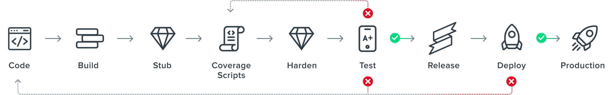

[][rf-link]

<h1> community-images </h1>

[![RF Hardened][rf-h-badge]][rf-link]
[![Dockerhub][dh-rf-badge]][dh-rf]
[![Slack][slack-badge]][slack-link]
[![License][license-badge]][license]
[![FOSSA Status][fossa-badge]][fossa-link]
[](https://bestpractices.coreinfrastructure.org/projects/6087)
[](https://github.com/rapidfort/community-images/actions/workflows/codeql.yml)

[Getting started](#getting-started) ·
[Contributing](CONTRIBUTING.md) ·
[Build Process](#how-community-images-are-built) ·
[Additional resources](#additional-resources)

**RapidFort is a solution for building secure, optimized Docker containers.**

Every day, we scan the most popular Docker Hub container images and remove unused code. Then we publish the results to share with you.

Our container optimization process reduces the software attack surface and the chance of a vulnerability exploit.

Stop downloading container images with thousands of vulnerabilities. Start using secure containers with minimized attack surfaces.


## Getting Started

![Demo][demo]

[RapidFort](https://rapidfort.com) scans your Docker containers for vulnerabilities and looks for unused components that can be removed.

## What containers are supported?

We’ve optimized and hardened some of the most popular container images on Docker Hub and are making them available to the community.

| Repository                        | RapidFort Image                                | View Report                     |  Status    |
|-----------------------------------| ------------------------------------------     | ------------------------------- | --------   |
| [MariaDB][ mariadb-github-link]| [![dh][dh-rf-badge]][mariadb-rf-dh-image-link] | [![rf-h][rf-h-badge]][mariadb-rf-link] | [![mariadb-image-ft][mariadb-ft-badge]][mariadb-ft-badge-link] |
| [MongoDB®][ mongodb-github-link]| [![dh][dh-rf-badge]][mongodb-rf-dh-image-link] | [![rf-h][rf-h-badge]][mongodb-rf-link] | [![mongodb-image-ft][mongodb-ft-badge]][mongodb-ft-badge-link] |
| [MySQL][ mysql-github-link]| [![dh][dh-rf-badge]][mysql-rf-dh-image-link] | [![rf-h][rf-h-badge]][mysql-rf-link] | [![mysql-image-ft][mysql-ft-badge]][mysql-ft-badge-link] |
| [NGINX][ nginx-github-link]| [![dh][dh-rf-badge]][nginx-rf-dh-image-link] | [![rf-h][rf-h-badge]][nginx-rf-link] | [![nginx-image-ft][nginx-ft-badge]][nginx-ft-badge-link] |
| [PostgreSQL][ postgresql-github-link]| [![dh][dh-rf-badge]][postgresql-rf-dh-image-link] | [![rf-h][rf-h-badge]][postgresql-rf-link] | [![postgresql-image-ft][postgresql-ft-badge]][postgresql-ft-badge-link] |
| [Redis™][ redis-github-link]| [![dh][dh-rf-badge]][redis-rf-dh-image-link] | [![rf-h][rf-h-badge]][redis-rf-link] | [![redis-image-ft][redis-ft-badge]][redis-ft-badge-link] |
| [Redis™ Cluster][ redis-cluster-github-link]| [![dh][dh-rf-badge]][redis-cluster-rf-dh-image-link] | [![rf-h][rf-h-badge]][redis-cluster-rf-link] | [![redis-cluster-image-ft][redis-cluster-ft-badge]][redis-cluster-ft-badge-link] |
| [Envoy][ envoy-github-link]| [![dh][dh-rf-badge]][envoy-rf-dh-image-link] | [![rf-h][rf-h-badge]][envoy-rf-link] | [![envoy-image-ft][envoy-ft-badge]][envoy-ft-badge-link] |
| [Fluentd][ fluentd-github-link]| [![dh][dh-rf-badge]][fluentd-rf-dh-image-link] | [![rf-h][rf-h-badge]][fluentd-rf-link] | [![fluentd-image-ft][fluentd-ft-badge]][fluentd-ft-badge-link] |
| [Grafana Oncall][ oncall-github-link]| [![dh][dh-rf-badge]][oncall-rf-dh-image-link] | [![rf-h][rf-h-badge]][oncall-rf-link] | [![oncall-image-ft][oncall-ft-badge]][oncall-ft-badge-link] |
| [InfluxDB™][ influxdb-github-link]| [![dh][dh-rf-badge]][influxdb-rf-dh-image-link] | [![rf-h][rf-h-badge]][influxdb-rf-link] | [![influxdb-image-ft][influxdb-ft-badge]][influxdb-ft-badge-link] |
| [Etcd][ etcd-github-link]| [![dh][dh-rf-badge]][etcd-rf-dh-image-link] | [![rf-h][rf-h-badge]][etcd-rf-link] | [![etcd-image-ft][etcd-ft-badge]][etcd-ft-badge-link] |
| [NATS][ nats-github-link]| [![dh][dh-rf-badge]][nats-rf-dh-image-link] | [![rf-h][rf-h-badge]][nats-rf-link] | [![nats-image-ft][nats-ft-badge]][nats-ft-badge-link] |
| [Redis™ IronBank][ redis-ib-github-link]| [![dh][dh-rf-badge]][redis-ib-rf-dh-image-link] | [![rf-h][rf-h-badge]][redis-ib-rf-link] | [![redis-ib-image-ft][redis-ib-ft-badge]][redis-ib-ft-badge-link] |
| [PostgreSQL IronBank][ postgresql-ib-github-link]| [![dh][dh-rf-badge]][postgresql-ib-rf-dh-image-link] | [![rf-h][rf-h-badge]][postgresql-ib-rf-link] | [![postgresql-ib-image-ft][postgresql-ib-ft-badge]][postgresql-ib-ft-badge-link] |
| [NGINX IronBank][ nginx-ib-github-link]| [![dh][dh-rf-badge]][nginx-ib-rf-dh-image-link] | [![rf-h][rf-h-badge]][nginx-ib-rf-link] | [![nginx-ib-image-ft][nginx-ib-ft-badge]][nginx-ib-ft-badge-link] |
| [Wordpress][ wordpress-github-link]| [![dh][dh-rf-badge]][wordpress-rf-dh-image-link] | [![rf-h][rf-h-badge]][wordpress-rf-link] | [![wordpress-image-ft][wordpress-ft-badge]][wordpress-ft-badge-link] |
| [RabbitMQ][ rabbitmq-github-link]| [![dh][dh-rf-badge]][rabbitmq-rf-dh-image-link] | [![rf-h][rf-h-badge]][rabbitmq-rf-link] | [![rabbitmq-image-ft][rabbitmq-ft-badge]][rabbitmq-ft-badge-link] |
| [HTTPD][ httpd-github-link]| [![dh][dh-rf-badge]][httpd-rf-dh-image-link] | [![rf-h][rf-h-badge]][httpd-rf-link] | [![httpd-image-ft][httpd-ft-badge]][httpd-ft-badge-link] |

### How to use Community Images

Here’s what you can do with Community Images.

```sh
# Docker
$ docker run --name redis -e ALLOW_EMPTY_PASSWORD=yes rapidfort/redis:latest

# Docker compose 
$ docker-compose up -d

# Kubernetes Helm
$ helm repo add bitnami https://charts.bitnami.com/bitnami

# install redis, just replace repository with RapidFort registry
$ helm install my-redis bitnami/redis --set image.repository=rapidfort/redis

# install postgresql
$ helm install my-postgresql bitnami/postgresql --set image.repository=rapidfort/postgresql

```
## How Community Images are Built

Source images are run through an optimization process that identifies and removes unused components from the image.
You can contribute to this project by adding new images, improving coverage scripts, and adding regression and benchmark tests.



## Additional Resources

Learn more about container optimization at [RapidFort.com](https://rapidfort.com).


[rf-link]: https://rapidfort.com 

[rf-h-badge]: https://img.shields.io/static/v1?label=RapidFort&labelColor=333F48&message=hardened&color=50B4C4&logo=data:image/png;base64,iVBORw0KGgoAAAANSUhEUgAAACcAAAAkCAYAAAAKNyObAAAACXBIWXMAACE4AAAhOAFFljFgAAAAAXNSR0IArs4c6QAAAARnQU1BAACxjwv8YQUAAAHvSURBVHgB7ZjvTcMwEMUvEgNkhNuAjOAR2IAyQbsB2YAyQbsBYoKwQdjA3aAjHA514Xq1Hf9r6QeeFKVJ3tkv+cWOVYCAiKg124b82gZqe0+NNlsHJbLBxthg1o+RASetIEdTJxnBRvtUMCHgM6TIBtMZwY7SiQFfrhUsN+Ao/TJYR3WC5QY88/Nge6oXLBRwO+P/GcnNMZzZteBR0zQfogM0O4Q47Uz9TtSrUIHs71+paugw16Dn+qt5xJ/TD4viEcrE25tepaXPaHxP350GXtD10WwHQWjQxKhl7YUGRg/MuPaY9vxuzPFA+RpEW9rj0yCMbcCsmG9B+Xpk7YRo4RnjQEEttBiBtAefyI23BtoYpBrmRO6ZX0EZWo60c1yfaGBMOKRzdKVocYZO/NpuMss7E9cHitcc0gFS5Qig2LUUtCGkmmJwOsJJvLlokdWtfMFzAvLGctCOooYPtg2USoRQ7HwM2hXzIzuvKQenIxzHm4oWmZ9TKF1AnAR8sI2moB093nKcjoBvtnHFzoXQ8qeMDGcLtUW/i4NYtJ3jJhRcSnRYHMSg1Q5PD5cWHT4/ih0vIpDOf9QrhZtQLsWxlILT8AjXEol/iQRaiVTBX4pO57D6U0WJBFoFtyaLtuqLfwf19G62e7hFWbQKKuoLYovGDo9dW28AAAAASUVORK5CYII=

[fossa-badge]: https://app.fossa.com/api/projects/git%2Bgithub.com%2Frapidfort%2Fcommunity-images.svg?type=shield
[fossa-link]: https://app.fossa.com/projects/git%2Bgithub.com%2Frapidfort%2Fcommunity-images?ref=badge_shield

[dh-rf-badge]: https://img.shields.io/badge/dockerhub-images-important.svg?logo=Docker
[dh-rf]: https://hub.docker.com/u/rapidfort
[license-badge]: https://img.shields.io/github/license/rapidfort/community-images?color=lightgray&style=flat-square
[license]: https://github.com/rapidfort/community-images/blob/main/LICENSE
[demo]: contrib/demo.gif

[slack-badge]: https://img.shields.io/static/v1?label=Join&message=slack&logo=slack&logoColor=E01E5A&color=4A154B
[slack-link]: https://join.slack.com/t/slack-ch72160/shared_invite/zt-1cafpzlyb-9I5He8olcp~FxmpZKxR~CA


[mariadb-github-link]: https://github.com/rapidfort/community-images/tree/main/community_images/mariadb/bitnami
[mariadb-dh-img-pulls-badge]: https://img.shields.io/docker/pulls/rapidfort/mariadb?logo=docker&logoColor=white
[mariadb-rf-dh-image-link]: https://hub.docker.com/r/rapidfort/mariadb
[mariadb-ft-badge]: https://github.com/rapidfort/community-images/actions/workflows/mariadb_bitnami.yml/badge.svg
[mariadb-ft-badge-link]: https://github.com/rapidfort/community-images/actions/workflows/mariadb_bitnami.yml
[mariadb-rf-link]:https://frontrow.rapidfort.com/app/community/imageinfo/docker.io%2Fbitnami%2Fmariadb?utm_source=gh-ci-landing&utm_medium=view-report&utm_id=rsa-ci-2022

[mongodb-github-link]: https://github.com/rapidfort/community-images/tree/main/community_images/mongodb/bitnami
[mongodb-dh-img-pulls-badge]: https://img.shields.io/docker/pulls/rapidfort/mongodb?logo=docker&logoColor=white
[mongodb-rf-dh-image-link]: https://hub.docker.com/r/rapidfort/mongodb
[mongodb-ft-badge]: https://github.com/rapidfort/community-images/actions/workflows/mongodb_bitnami.yml/badge.svg
[mongodb-ft-badge-link]: https://github.com/rapidfort/community-images/actions/workflows/mongodb_bitnami.yml
[mongodb-rf-link]:https://frontrow.rapidfort.com/app/community/imageinfo/docker.io%2Fbitnami%2Fmongodb?utm_source=gh-ci-landing&utm_medium=view-report&utm_id=rsa-ci-2022

[mysql-github-link]: https://github.com/rapidfort/community-images/tree/main/community_images/mysql/bitnami
[mysql-dh-img-pulls-badge]: https://img.shields.io/docker/pulls/rapidfort/mysql?logo=docker&logoColor=white
[mysql-rf-dh-image-link]: https://hub.docker.com/r/rapidfort/mysql
[mysql-ft-badge]: https://github.com/rapidfort/community-images/actions/workflows/mysql_bitnami.yml/badge.svg
[mysql-ft-badge-link]: https://github.com/rapidfort/community-images/actions/workflows/mysql_bitnami.yml
[mysql-rf-link]:https://frontrow.rapidfort.com/app/community/imageinfo/docker.io%2Fbitnami%2Fmysql?utm_source=gh-ci-landing&utm_medium=view-report&utm_id=rsa-ci-2022

[nginx-github-link]: https://github.com/rapidfort/community-images/tree/main/community_images/nginx/bitnami
[nginx-dh-img-pulls-badge]: https://img.shields.io/docker/pulls/rapidfort/nginx?logo=docker&logoColor=white
[nginx-rf-dh-image-link]: https://hub.docker.com/r/rapidfort/nginx
[nginx-ft-badge]: https://github.com/rapidfort/community-images/actions/workflows/nginx_bitnami.yml/badge.svg
[nginx-ft-badge-link]: https://github.com/rapidfort/community-images/actions/workflows/nginx_bitnami.yml
[nginx-rf-link]:https://frontrow.rapidfort.com/app/community/imageinfo/docker.io%2Fbitnami%2Fnginx?utm_source=gh-ci-landing&utm_medium=view-report&utm_id=rsa-ci-2022

[postgresql-github-link]: https://github.com/rapidfort/community-images/tree/main/community_images/postgresql/bitnami
[postgresql-dh-img-pulls-badge]: https://img.shields.io/docker/pulls/rapidfort/postgresql?logo=docker&logoColor=white
[postgresql-rf-dh-image-link]: https://hub.docker.com/r/rapidfort/postgresql
[postgresql-ft-badge]: https://github.com/rapidfort/community-images/actions/workflows/postgresql_bitnami.yml/badge.svg
[postgresql-ft-badge-link]: https://github.com/rapidfort/community-images/actions/workflows/postgresql_bitnami.yml
[postgresql-rf-link]:https://frontrow.rapidfort.com/app/community/imageinfo/docker.io%2Fbitnami%2Fpostgresql?utm_source=gh-ci-landing&utm_medium=view-report&utm_id=rsa-ci-2022

[redis-github-link]: https://github.com/rapidfort/community-images/tree/main/community_images/redis/bitnami
[redis-dh-img-pulls-badge]: https://img.shields.io/docker/pulls/rapidfort/redis?logo=docker&logoColor=white
[redis-rf-dh-image-link]: https://hub.docker.com/r/rapidfort/redis
[redis-ft-badge]: https://github.com/rapidfort/community-images/actions/workflows/redis_bitnami.yml/badge.svg
[redis-ft-badge-link]: https://github.com/rapidfort/community-images/actions/workflows/redis_bitnami.yml
[redis-rf-link]:https://frontrow.rapidfort.com/app/community/imageinfo/docker.io%2Fbitnami%2Fredis?utm_source=gh-ci-landing&utm_medium=view-report&utm_id=rsa-ci-2022

[redis-cluster-github-link]: https://github.com/rapidfort/community-images/tree/main/community_images/redis-cluster/bitnami
[redis-cluster-dh-img-pulls-badge]: https://img.shields.io/docker/pulls/rapidfort/redis-cluster?logo=docker&logoColor=white
[redis-cluster-rf-dh-image-link]: https://hub.docker.com/r/rapidfort/redis-cluster
[redis-cluster-ft-badge]: https://github.com/rapidfort/community-images/actions/workflows/redis-cluster_bitnami.yml/badge.svg
[redis-cluster-ft-badge-link]: https://github.com/rapidfort/community-images/actions/workflows/redis-cluster_bitnami.yml
[redis-cluster-rf-link]:https://frontrow.rapidfort.com/app/community/imageinfo/docker.io%2Fbitnami%2Fredis-cluster?utm_source=gh-ci-landing&utm_medium=view-report&utm_id=rsa-ci-2022

[envoy-github-link]: https://github.com/rapidfort/community-images/tree/main/community_images/envoy/bitnami
[envoy-dh-img-pulls-badge]: https://img.shields.io/docker/pulls/rapidfort/envoy?logo=docker&logoColor=white
[envoy-rf-dh-image-link]: https://hub.docker.com/r/rapidfort/envoy
[envoy-ft-badge]: https://github.com/rapidfort/community-images/actions/workflows/envoy_bitnami.yml/badge.svg
[envoy-ft-badge-link]: https://github.com/rapidfort/community-images/actions/workflows/envoy_bitnami.yml
[envoy-rf-link]:https://frontrow.rapidfort.com/app/community/imageinfo/docker.io%2Fbitnami%2Fenvoy?utm_source=gh-ci-landing&utm_medium=view-report&utm_id=rsa-ci-2022

[fluentd-github-link]: https://github.com/rapidfort/community-images/tree/main/community_images/fluentd/bitnami
[fluentd-dh-img-pulls-badge]: https://img.shields.io/docker/pulls/rapidfort/fluentd?logo=docker&logoColor=white
[fluentd-rf-dh-image-link]: https://hub.docker.com/r/rapidfort/fluentd
[fluentd-ft-badge]: https://github.com/rapidfort/community-images/actions/workflows/fluentd_bitnami.yml/badge.svg
[fluentd-ft-badge-link]: https://github.com/rapidfort/community-images/actions/workflows/fluentd_bitnami.yml
[fluentd-rf-link]:https://frontrow.rapidfort.com/app/community/imageinfo/docker.io%2Fbitnami%2Ffluentd?utm_source=gh-ci-landing&utm_medium=view-report&utm_id=rsa-ci-2022

[oncall-github-link]: https://github.com/rapidfort/community-images/tree/main/community_images/oncall/grafana
[oncall-dh-img-pulls-badge]: https://img.shields.io/docker/pulls/rapidfort/oncall?logo=docker&logoColor=white
[oncall-rf-dh-image-link]: https://hub.docker.com/r/rapidfort/oncall
[oncall-ft-badge]: https://github.com/rapidfort/community-images/actions/workflows/oncall_grafana.yml/badge.svg
[oncall-ft-badge-link]: https://github.com/rapidfort/community-images/actions/workflows/oncall_grafana.yml
[oncall-rf-link]:https://frontrow.rapidfort.com/app/community/imageinfo/docker.io%2Fgrafana%2Foncall?utm_source=gh-ci-landing&utm_medium=view-report&utm_id=rsa-ci-2022

[influxdb-github-link]: https://github.com/rapidfort/community-images/tree/main/community_images/influxdb/bitnami
[influxdb-dh-img-pulls-badge]: https://img.shields.io/docker/pulls/rapidfort/influxdb?logo=docker&logoColor=white
[influxdb-rf-dh-image-link]: https://hub.docker.com/r/rapidfort/influxdb
[influxdb-ft-badge]: https://github.com/rapidfort/community-images/actions/workflows/influxdb_bitnami.yml/badge.svg
[influxdb-ft-badge-link]: https://github.com/rapidfort/community-images/actions/workflows/influxdb_bitnami.yml
[influxdb-rf-link]:https://frontrow.rapidfort.com/app/community/imageinfo/docker.io%2Fbitnami%2Finfluxdb?utm_source=gh-ci-landing&utm_medium=view-report&utm_id=rsa-ci-2022

[etcd-github-link]: https://github.com/rapidfort/community-images/tree/main/community_images/etcd/bitnami
[etcd-dh-img-pulls-badge]: https://img.shields.io/docker/pulls/rapidfort/etcd?logo=docker&logoColor=white
[etcd-rf-dh-image-link]: https://hub.docker.com/r/rapidfort/etcd
[etcd-ft-badge]: https://github.com/rapidfort/community-images/actions/workflows/etcd_bitnami.yml/badge.svg
[etcd-ft-badge-link]: https://github.com/rapidfort/community-images/actions/workflows/etcd_bitnami.yml
[etcd-rf-link]:https://frontrow.rapidfort.com/app/community/imageinfo/docker.io%2Fbitnami%2Fetcd?utm_source=gh-ci-landing&utm_medium=view-report&utm_id=rsa-ci-2022

[nats-github-link]: https://github.com/rapidfort/community-images/tree/main/community_images/nats/bitnami
[nats-dh-img-pulls-badge]: https://img.shields.io/docker/pulls/rapidfort/nats?logo=docker&logoColor=white
[nats-rf-dh-image-link]: https://hub.docker.com/r/rapidfort/nats
[nats-ft-badge]: https://github.com/rapidfort/community-images/actions/workflows/nats_bitnami.yml/badge.svg
[nats-ft-badge-link]: https://github.com/rapidfort/community-images/actions/workflows/nats_bitnami.yml
[nats-rf-link]:https://frontrow.rapidfort.com/app/community/imageinfo/docker.io%2Fbitnami%2Fnats?utm_source=gh-ci-landing&utm_medium=view-report&utm_id=rsa-ci-2022

[redis-ib-github-link]: https://github.com/rapidfort/community-images/tree/main/community_images/redis/ironbank
[redis-ib-dh-img-pulls-badge]: https://img.shields.io/docker/pulls/rapidfort/redis6-ib?logo=docker&logoColor=white
[redis-ib-rf-dh-image-link]: https://hub.docker.com/r/rapidfort/redis6-ib
[redis-ib-ft-badge]: https://github.com/rapidfort/community-images/actions/workflows/redis_ironbank.yml/badge.svg
[redis-ib-ft-badge-link]: https://github.com/rapidfort/community-images/actions/workflows/redis_ironbank.yml
[redis-ib-rf-link]:https://frontrow.rapidfort.com/app/community/imageinfo/registry1.dso.mil%2Fironbank%2Fopensource%2Fredis%2Fredis6?utm_source=gh-ci-landing&utm_medium=view-report&utm_id=rsa-ci-2022

[postgresql-ib-github-link]: https://github.com/rapidfort/community-images/tree/main/community_images/postgresql/ironbank
[postgresql-ib-dh-img-pulls-badge]: https://img.shields.io/docker/pulls/rapidfort/postgresql12-ib?logo=docker&logoColor=white
[postgresql-ib-rf-dh-image-link]: https://hub.docker.com/r/rapidfort/postgresql12-ib
[postgresql-ib-ft-badge]: https://github.com/rapidfort/community-images/actions/workflows/postgresql_ironbank.yml/badge.svg
[postgresql-ib-ft-badge-link]: https://github.com/rapidfort/community-images/actions/workflows/postgresql_ironbank.yml
[postgresql-ib-rf-link]:https://frontrow.rapidfort.com/app/community/imageinfo/registry1.dso.mil%2Fironbank%2Fopensource%2Fpostgres%2Fpostgresql12?utm_source=gh-ci-landing&utm_medium=view-report&utm_id=rsa-ci-2022

[nginx-ib-github-link]: https://github.com/rapidfort/community-images/tree/main/community_images/nginx/ironbank
[nginx-ib-dh-img-pulls-badge]: https://img.shields.io/docker/pulls/rapidfort/nginx-ib?logo=docker&logoColor=white
[nginx-ib-rf-dh-image-link]: https://hub.docker.com/r/rapidfort/nginx-ib
[nginx-ib-ft-badge]: https://github.com/rapidfort/community-images/actions/workflows/nginx_ironbank.yml/badge.svg
[nginx-ib-ft-badge-link]: https://github.com/rapidfort/community-images/actions/workflows/nginx_ironbank.yml
[nginx-ib-rf-link]:https://frontrow.rapidfort.com/app/community/imageinfo/registry1.dso.mil%2Fironbank%2Fopensource%2Fnginx%2Fnginx?utm_source=gh-ci-landing&utm_medium=view-report&utm_id=rsa-ci-2022

[wordpress-github-link]: https://github.com/rapidfort/community-images/tree/main/community_images/wordpress/bitnami
[wordpress-dh-img-pulls-badge]: https://img.shields.io/docker/pulls/rapidfort/wordpress?logo=docker&logoColor=white
[wordpress-rf-dh-image-link]: https://hub.docker.com/r/rapidfort/wordpress
[wordpress-ft-badge]: https://github.com/rapidfort/community-images/actions/workflows/wordpress_bitnami.yml/badge.svg
[wordpress-ft-badge-link]: https://github.com/rapidfort/community-images/actions/workflows/wordpress_bitnami.yml
[wordpress-rf-link]:https://frontrow.rapidfort.com/app/community/imageinfo/docker.io%2Fbitnami%2Fwordpress?utm_source=gh-ci-landing&utm_medium=view-report&utm_id=rsa-ci-2022

[rabbitmq-github-link]: https://github.com/rapidfort/community-images/tree/main/community_images/rabbitmq/bitnami
[rabbitmq-dh-img-pulls-badge]: https://img.shields.io/docker/pulls/rapidfort/rabbitmq?logo=docker&logoColor=white
[rabbitmq-rf-dh-image-link]: https://hub.docker.com/r/rapidfort/rabbitmq
[rabbitmq-ft-badge]: https://github.com/rapidfort/community-images/actions/workflows/rabbitmq_bitnami.yml/badge.svg
[rabbitmq-ft-badge-link]: https://github.com/rapidfort/community-images/actions/workflows/rabbitmq_bitnami.yml
[rabbitmq-rf-link]:https://frontrow.rapidfort.com/app/community/imageinfo/docker.io%2Fbitnami%2Frabbitmq?utm_source=gh-ci-landing&utm_medium=view-report&utm_id=rsa-ci-2022

[httpd-github-link]: https://github.com/rapidfort/community-images/tree/main/community_images/httpd/bitnami
[httpd-dh-img-pulls-badge]: https://img.shields.io/docker/pulls/rapidfort/httpd?logo=docker&logoColor=white
[httpd-rf-dh-image-link]: https://hub.docker.com/r/rapidfort/httpd
[httpd-ft-badge]: https://github.com/rapidfort/community-images/actions/workflows/httpd_bitnami.yml/badge.svg
[httpd-ft-badge-link]: https://github.com/rapidfort/community-images/actions/workflows/httpd_bitnami.yml
[httpd-rf-link]:https://frontrow.rapidfort.com/app/community/imageinfo/docker.io%2Fbitnami%2Fhttpd?utm_source=gh-ci-landing&utm_medium=view-report&utm_id=rsa-ci-2022
