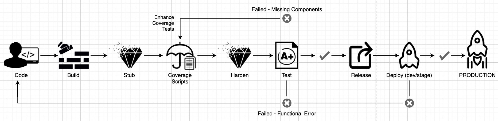

 

# Trouble Shooting Guide

## Background: 
Community Images are generated by RapidFort using a process called hardening. We pick up a source image (upstream image), add coverage scripts and harden the image.
Once the hardened image is developed, we run some benchmark tests on these hardened images to ensure they perform as expected.

Community images project rely on upstream source image to work correctly. Broadly, the issues will fall into three categories:

1. ### Coverage script was not covering the feature which is being exercised in production.
    > Remediation: We need to enhance coverage scripts. Please report an issue and provide PR if possible.

1. ### Defect in RapidFort hardening system is introducing a defect in community image
    > Remediation: Please report an issue and we would work with our core engineering team to investigate and fix this issue.

1. ### Upstream source image is being incorrectly used.
    > Remediation: Please file a report and update the documentation for the image.

1. ### Upstream source image has introduced a defect
    > Remediation: Please file a report on the source project. For eg: Bitnami Postgres image.
